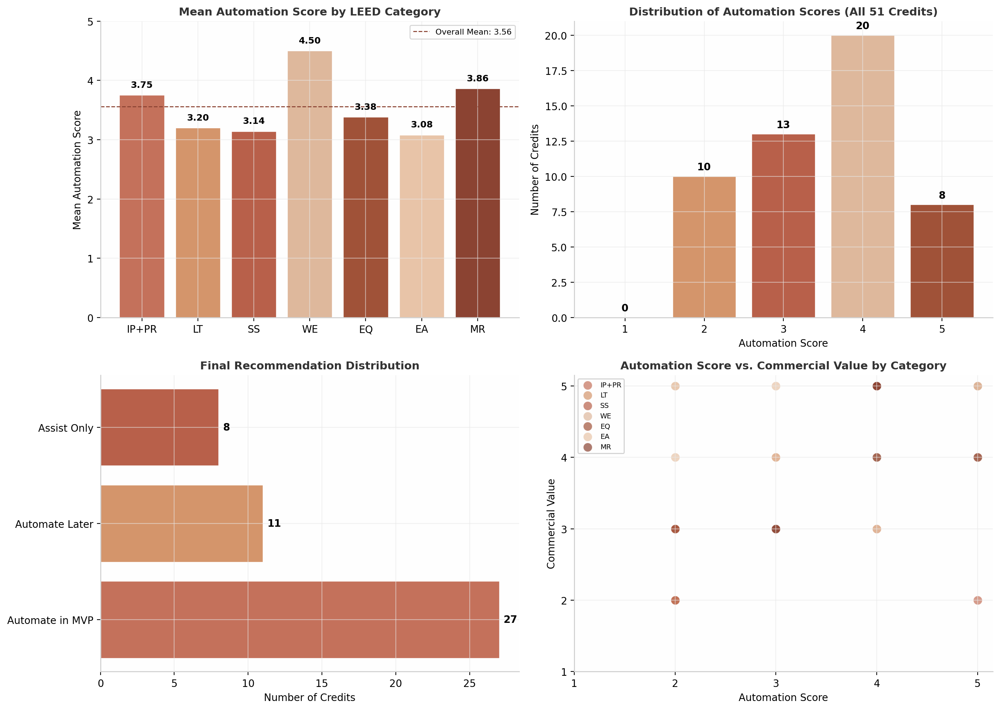

## Executive Summary

The LEED certification process consumes 200–400 consultant-hours per project, with documentation, calculation, and narrative preparation representing the single largest time expenditure in a sustainability consultant's workflow. This report presents the first systematic analysis of AI automation potential across the complete LEED v5 BD+C credit library — 51 credits spanning eight categories — and identifies a concrete, commercially viable path to reducing that burden by 94–152 hours per project through targeted automation.

### The Analysis at a Glance

Each credit was scored across three dimensions: **Automation Suitability** (1–5) measuring documentation type, data input accessibility, and AI technique applicability; **Commercial Value** (1–5) capturing time saved, repeatability, and willingness to pay; and **Risk** (Low/Medium/High) assessing reviewer rejection probability and liability exposure. The composite analysis yields a mean automation score of **3.51 out of 5** — indicating that the majority of LEED documentation work is structurally amenable to AI assistance.

| Scoring Distribution | Credits | Share | Automation Characteristic |
|:---|:---:|:---|:---|
| Score 5/5 | 8 | 16% | Template-driven; deterministic outputs |
| Score 4/5 | 20 | 39% | AI handles 80%+ of workflow; human review required |
| Score 3/5 | 13 | 25% | AI handles 50–80%; professional judgment essential |
| Score 2/5 | 10 | 20% | Limited to data entry assistance and template filling |
| Score 1/5 | 0 | 0% | No credit scored below 2/5 |

The distribution is right-skewed toward automatibility. **Twenty-eight credits (55%) scored 4 or 5**, establishing a robust foundation for an MVP platform. No credit scored below 2/5, confirming that even the most challenging LEED documentation tasks offer at least partial automation opportunity.

### Three-Tier Automation Classification

The 51 credits organize into three strategic tiers that define a phased product roadmap.

**Tier 1 — Full Automation (11 credits).** These credits scored 5/5 or high 4/5 and rely on deterministic logic, public data APIs, or rule-based compliance engines. They include Water Efficiency calculations (WEp2/WEc2), Low-emitting Materials (MRc3), Refrigerant Management (EAp5/EAc7), and Location & Transportation connectivity (LTc3). AI can produce submission-ready documentation with minimal review — typically 30–90 minutes of validation versus 8–40 hours of manual work.

**Tier 2 — AI-Assisted (15 credits).** These credits scored 3/5 or mid-range 4/5, where AI eliminates 50–85% of documentation burden but cannot substitute for professional judgment, field verification, or specialized engineering software. This tier includes the Integrative Process assessments (IPp1/IPp2), Electrification (EAc1), Enhanced Commissioning (EAc5), and Embodied Carbon (MRp2/MRc2). Product design must position AI as a documentation assistant that activates after consultants provide process inputs and design decisions.

**Tier 3 — Avoid Initially (25 credits).** These credits fall into four categories where near-term automation is impractical: energy modeling credits (EAp2, EAc2, EAc3) requiring ASHRAE 90.1 Appendix G simulation in eQuest or EnergyPlus; physical testing credits (EQc5) requiring ISO/IEC 17025 laboratory verification; complex commissioning credits requiring Commissioning Authority field engagement; and highly project-specific credits (PRc1, MRc1) where field conditions drive unique documentation.

| Category | Credits | Mean Auto Score | MVP Count | MVP Rate |
|:---|:---:|:---:|:---:|:---:|
| Water Efficiency | 4 | 4.50 | 4 | 100% |
| Materials & Resources | 7 | 3.86 | 6 | 86% |
| Integrative Process | 8 | 3.75 | 6 | 75% |
| Indoor Environmental Quality | 8 | 3.38 | 5 | 63% |
| Location & Transportation | 5 | 3.20 | 2 | 40% |
| Sustainable Sites | 7 | 3.14 | 3 | 43% |
| Energy & Atmosphere | 12 | 3.08 | 6 | 50% |
| **All Credits** | **51** | **3.51** | **31** | **61%** |

Water Efficiency leads at 4.50/5 — every credit is calculation-driven and universally applicable. Materials & Resources follows at 3.86, benefiting from deterministic product database lookups. Energy and Atmosphere trails at 3.08, weighed down by three energy modeling prerequisites. Overall, **31 credits (61%) are recommended for the initial product scope**.

### The MVP Recommendation: Five Credit Suites

The recommended minimum viable product consolidates the highest-confidence automation targets into five integrated suites, each pairing prerequisites with associated credits to exploit natural data dependencies. These suites were selected through a weighted framework requiring scores of 4+ on both automation and commercial value, Low or Medium risk classification, and positive cross-credit synergy.

| MVP Suite | Credits | Auto Score | Time Saved/Project | Est. Value at $150/hr |
|:---|:---|:---:|:---:|:---:|
| Water Efficiency | WEp2 + WEc2 | 5 / 5 | 17–27 hrs | $2,550–$4,050 |
| Integrative Process Assessment | IPp1 + IPp2 | 4 / 5 | 20–28 hrs | $3,000–$4,200 |
| Low-Emitting Materials | MRc3 | 5 / 5 | 37–59 hrs | $5,550–$8,850 |
| Quality Plans | EQp1 + EQp2 | 4 / 5 | 12–22 hrs | $1,800–$3,300 |
| Refrigerant Management | EAp5 + EAc7 | 4–5 / 5 | 8–16 hrs | $1,200–$2,400 |
| **Combined Total** | | | **94–152 hrs** | **$14,100–$22,800** |

The **Water Efficiency Suite** serves as the ideal wedge product: 100% of LEED projects must comply with WEp2, the calculation engine is pure arithmetic on uploaded fixture schedules, and the WEc2 multi-option optimizer delivers immediate point-maximization value that consultants can articulate to clients. The **Low-emitting Materials Suite** (MRc3) offers the highest per-credit time savings at 37–59 hours — automating the universally despised certification lookup workflow across 200–400 products per project. The **Integrative Process Assessment Suite** (IPp1/IPp2) addresses the two prerequisites that firms report consuming more staff time than any others except energy modeling, replacing 10–20 hours of manual government database research with automated FEMA, NOAA, USGS, and Census API queries.

### Platform Vision and Commercial Model

The platform operates as a one-stop consultant workspace where project data enters through a structured intake module, flows through specialized AI agents — document parsers, calculation engines, web researchers, narrative generators — and exits as audit-ready Evidence Packs formatted for LEED Online submission. A Retrieval-Augmented Generation (RAG) knowledge base indexes the LEED v5 reference guide, applicable ASHRAE standards, and all uploaded project documents to ensure every claim is grounded in verifiable source material.[^1^]

The commercial model uses per-suite subscription pricing with three tiers. The Starter tier ($3,600–$4,800 annually) includes any one suite for boutique consultancies handling 5–15 projects per year. The Professional tier ($9,600–$14,400) includes all five suites for mid-size firms with 20–50 projects. The Enterprise tier adds API access, custom integrations, and volume pricing for 50+ projects. At 50 paying customers — a blend across tiers — projected annual recurring revenue ranges from **$480,000 to $720,000**. The addressable market of approximately 2,500 LEED consultancies in North America supports a path to $2–4 million ARR at 15–25% market penetration within three years.[^2^]

### Implementation Roadmap

A three-phase development roadmap delivers the full MVP scope over eight months.

**Phase 1 (Months 1–3)** targets the three prerequisite-heavy suites applying to 100% of projects: Water Efficiency, Refrigerant Management, and Indoor Environmental Quality Plans. This phase builds the shared infrastructure — document parsing engines, calculation frameworks, and refrigerant GWP databases — that all subsequent credits depend upon. A team of 4–5 engineers can deliver this scope within 12 weeks.

**Phase 2 (Months 3–5)** introduces the assessment-heavy suites: Integrative Process (IPp1/IPp2) and Low-Emitting Materials (MRc3). These require more sophisticated natural language processing — parallel web research agents querying 10+ government databases, and a multi-database certification query engine for MRc3. The team expands to 5–6 engineers with an NLP specialist.

**Phase 3 (Months 5–8)** focuses on integration: cross-credit data pipelines enabling WEp2 outputs to flow automatically into WEc2 and WEc1, professional review workflows with mandatory sign-off gates, and beta testing with 5–10 design firms beginning in Month 6.

### Quality, Risk, and Trust Architecture

Automation of professional documentation introduces risks including AI hallucination, OCR extraction errors, and calculation formula misapplication. The platform addresses these through a three-layer framework. **Prevention controls** enforce source-grounded generation (every claim must cite a retrieved document or verified public dataset), rules-based validation against LEED v5 thresholds, and mandatory evidence mapping. **Detection controls** run hallucination detection, red-flag alerts, and reviewer-style QA checklists mimicking USGBC evaluation patterns. **Governance controls** mandate human approval gates — LEED AP review for narratives, licensed engineer review for calculations — with a cryptographically chained audit trail providing tamper-evident logging.[^3^]

The estimated risk reduction is substantial: prevention controls eliminate 80–85% of common errors before they reach human review, detection controls catch 10–15% of residual issues, and governance controls ensure the remaining 5% is identified by qualified professionals before USGBC submission. This architecture enables the platform to achieve 65–92% time savings per credit while maintaining documentation quality that meets or exceeds manually prepared submissions.

### The Strategic Case

LEED v5 introduces a new credit structure, updated prerequisites, and an emphasis on measured performance that increases documentation demands on consultants. Firms adopting automation early will capture compounding advantages: faster project turnaround, reduced staff burnout, and capacity to pursue more projects without proportional hiring. This platform is positioned not as a replacement for LEED AP expertise but as an **AI-powered documentation assistant** — handling data retrieval, calculation, and templated narrative generation so consultants can focus on design strategy and professional judgment that automation cannot replicate. The 31 credits recommended for automation represent the largest single opportunity to reduce LEED delivery costs while improving documentation consistency.

---

## 1. LEED v5 Credit Automation Matrix

### 1.1 Methodology and Scoring Framework

Each of the 51 LEED v5 BD+C credits is scored across three independent dimensions.

**Automation Score (1–5)** assesses: *documentation type* (narrative, calculation, physical testing, or field verification); *data inputs* (API availability, document extractability, or physical measurement dependence); *AI technique applicability*; and *verification feasibility* against known standards. The composite reflects the lowest constraining factor. Scores of 5/5 require only template filling; 4/5 indicates AI handles 80+ percent; 3/5 reflects 50–80 percent; 2/5 indicates 20–50 percent assistance. No credit scored 1/5.

**Commercial Value (1–5)** weights: time saved; documentation burden; repeatability; pursuit frequency; and willingness to pay. Prerequisites score higher as they apply to 100 percent of pursuing projects.

**Risk** uses three tiers: *Low Risk* (deterministic outputs); *Medium Risk* (engineering judgment, cross-referenced standards); *High Risk* (physical testing or professional judgment AI cannot substitute). Recommendations: *Automate in MVP*; *Automate Later*; *Assist Only*; *Avoid*. No credit received *Avoid*.

### 1.2 Complete Credit-by-Credit Analysis

The following table presents all 51 LEED v5 BD+C credits. AI Techniques: LLM = large language model; CE = calculation engine; Tmpl = template; GIS = geospatial; Web = web research; Parse = document parsing; Sim = simulation; CV = computer vision.

| LEED Category | Credit ID | Credit Name | Documentation Type | Required Inputs | AI Techniques | Auto /5 | Value /5 | Risk | Final Recommendation |
|:---|:---|:---|:---|:---|:---|:---:|:---:|:---|:---|
| **IP+PR** | IPp1 | Climate Resilience Assessment | Assessment report | Project address, building type, service life | LLM, Web, Tmpl, GIS | 4 | 5 | Medium | **Automate in MVP** |
| **IP+PR** | IPp2 | Human Impact Assessment | Assessment report | Project address, demographics data | LLM, Web, Tmpl | 4 | 5 | Medium | **Automate in MVP** |
| **IP+PR** | IPp3 | Carbon Assessment | Data compilation | Cross-credit data (EAp1, EAp5, MRp2) | Tmpl, Parse | 2 | 3 | Low | **Assist Only** |
| **IP+PR** | IPp4 | Tenant Guidelines | Policy document | LEED credits attempted, contact info | LLM, Tmpl | 5 | 4 | Low | **Automate in MVP** |
| **IP+PR** | IPc1 | Integrative Design Process | Process documentation | Team roster, charrette notes, goals | LLM, Tmpl | 3 | 4 | Low | **Automate in MVP** |
| **IP+PR** | IPc2 | Green Leases | Legal document | Best practice selections, project data | LLM, Tmpl, CE | 5 | 5 | Medium | **Automate in MVP** |
| **IP+PR** | PRc1 | Project Priorities | Variable pathways | Underlying credit achievements | LLM, Web | 2 | 3 | High | **Automate Later** |
| **IP+PR** | PRc2 | LEED AP | Form entry | Credential number, name, specialty | Tmpl | 5 | 2 | Low | **Automate in MVP** |
| **LT** | LTc1 | Sensitive Land Protection | GIS analysis | Site boundary polygon, site plan | GIS, Web, LLM, CE | 4 | 3 | Medium | **Automate in MVP** |
| **LT** | LTc2 | Equitable Development | Policy documents | Brownfield letters, employment records, AMI | Web, Parse, Tmpl | 2 | 2 | Medium | **Assist Only** |
| **LT** | LTc3 | Compact & Connected Development | GIS analysis, data report | Project address | GIS, Web, CE, API | 5 | 5 | Low | **Automate in MVP** |
| **LT** | LTc4 | Transportation Demand Management | Calculation, narrative | Occupancy counts, parking study | CE, GIS, LLM, Web | 3 | 4 | Medium | **Automate Later** |
| **LT** | LTc5 | Electric Vehicles | Drawing markup | Parking count, EVSE cut sheets | CE, Parse | 2 | 2 | Low | **Assist Only** |
| **SS** | SSp1 | Minimized Site Disturbance | Policy, checklist | Erosion control plan, site assessment | LLM, Tmpl, CV | 2 | 3 | Medium | **Assist Only** |
| **SS** | SSc1 | Biodiverse Habitat | Calculation, species list | Site plan, soil test, glass schedule | GIS, Web, LLM, CE | 3 | 3 | Medium | **Automate Later** |
| **SS** | SSc2 | Accessible Outdoor Space | Drawing markup | Site plan, landscape plan | CE | 2 | 2 | Low | **Assist Only** |
| **SS** | SSc3 | Rainwater Management | Hydrology model | Site plan, impervious surfaces | CE, GIS, Web, LLM | 4 | 4 | Medium | **Automate in MVP** |
| **SS** | SSc4 | Enhanced Resilient Site Design | Hazard assessment | IPp1 assessment, site plans | Web, GIS, LLM, Tmpl | 4 | 5 | Medium | **Automate in MVP** |
| **SS** | SSc5 | Heat Island Reduction | Calculation, data report | Site plan, roof plan, product specs | CE, Web, Parse | 4 | 4 | Low | **Automate in MVP** |
| **SS** | SSc6 | Light Pollution Reduction | Template checklist | Lighting fixture schedule, site plan | Tmpl, Parse, Web, CE | 3 | 3 | Low | **Automate Later** |
| **WE** | WEp1 | Water Metering & Reporting | Plan, commitment letter | Meter specs, plumbing drawings | Tmpl, LLM, Parse | 4 | 4 | Low | **Automate in MVP** |
| **WE** | WEp2 | Minimum Water Efficiency | Calculation, specification | Fixture schedule, cut sheets | CE, Parse, Tmpl | 5 | 5 | Low | **Automate in MVP** |
| **WE** | WEc1 | Water Metering & Leak Detection | Plan, layout drawing | Submeter specs, plumbing drawings | Tmpl, Parse, LLM | 4 | 4 | Low | **Automate in MVP** |
| **WE** | WEc2 | Enhanced Water Efficiency | Calculation, specification | Fixture schedule, equipment specs | CE, Parse, Tmpl | 5 | 5 | Low-Med | **Automate in MVP** |
| **EQ** | EQp1 | Construction Management | Plan, checklist, narrative | Project schedule, material list, site layout | LLM, Tmpl | 4 | 5 | Low | **Automate in MVP** |
| **EQ** | EQp2 | Fundamental Air Quality | Calculation, specification | HVAC schedules, OA rates, filtration specs | CE, Parse, LLM, Tmpl | 4 | 4 | Medium | **Automate in MVP** |
| **EQ** | EQp3 | No Smoking / Vehicle Idling | Plan, site plan | Site layout, building footprint | GIS, Tmpl, CE | 3 | 3 | Low | **Automate Later** |
| **EQ** | EQc1 | Enhanced Air Quality | Calculation, narrative | Ventilation calcs, IAQ model results | CE, Tmpl, Parse | 3 | 3 | Medium | **Automate Later** |
| **EQ** | EQc2 | Occupant Experience | Survey, calculation | Floor plans, glazing specs, luminaire data | Sim, LLM, CE, Tmpl | 4 | 4 | Medium | **Automate in MVP** |
| **EQ** | EQc3 | Accessibility & Inclusion | Checklist, narrative | Local accessibility codes, floor plans | Tmpl, LLM, GIS | 4 | 4 | Low | **Automate in MVP** |
| **EQ** | EQc4 | Resilient Spaces | Calculation, narrative | TMY weather, envelope specs, window schedule | Sim, Tmpl, LLM | 3 | 3 | Medium | **Automate Later** |
| **EQ** | EQc5 | Air Quality Testing & Monitoring | Test report, specification | Laboratory test results, monitor specs | Parse, Tmpl | 2 | 3 | High | **Assist Only** |
| **EA** | EAp1 | Decarbonization Plan | Narrative, plan | Energy model outputs, project location | Parse, LLM, Tmpl, CE | 4 | 5 | Low | **Automate in MVP** |
| **EA** | EAp2 | Minimum Energy Efficiency | Energy model | Complete ASHRAE 90.1 Appendix G model | Parse, CE | 2 | 5 | Medium | **Assist Only** |
| **EA** | EAp3 | Fundamental Commissioning | Plan, narrative | Building type, systems list, OPR/BOD | LLM, Parse, Tmpl | 3 | 4 | Low | **Automate Later** |
| **EA** | EAp4 | Energy Metering and Reporting | Specification, plan | System inventory, meter specs | Parse, Tmpl | 3 | 3 | Low | **Automate Later** |
| **EA** | EAp5 | Fundamental Refrigerant Mgmt | Inventory, calculation | Equipment schedules, refrigerant types | Parse, Web, CE | 4 | 4 | Low | **Automate in MVP** |
| **EA** | EAc1 | Electrification | Calculation, narrative | Heating/SWH equipment schedules | Parse, CE, Tmpl | 4 | 5 | Low | **Automate in MVP** |
| **EA** | EAc2 | Reduce Peak Thermal Loads | Energy model, testing | Air leakage results, WUFI/PHPP model | Parse, CE | 2 | 4 | Medium | **Assist Only** |
| **EA** | EAc3 | Enhanced Energy Efficiency | Energy model, calculation | ASHRAE 90.1 model, Section 11 tallies | Parse, CE, Web | 2 | 5 | Medium | **Assist Only** |
| **EA** | EAc4 | Renewable Energy | Calculation, contract | Energy model output, system specs | CE, Tmpl, Parse | 3 | 5 | Low-Med | **Automate in MVP** |
| **EA** | EAc5 | Enhanced Commissioning | Plan, specification | Systems inventory, CxP selections | LLM, Parse, Tmpl | 4 | 4 | Low | **Automate in MVP** |
| **EA** | EAc6 | Grid Interactive | Plan, calculation | Peak demand data, storage specs | CE, LLM, Tmpl | 3 | 3 | Medium | **Automate Later** |
| **EA** | EAc7 | Enhanced Refrigerant Mgmt | Calculation, inventory | EAp5 inventory, equipment status | CE, Parse, LLM, Tmpl | 5 | 4 | Low | **Automate in MVP** |
| **MR** | MRp1 | Zero Waste Operations | Plan, narrative | Building type, floor plans, location | LLM, Parse, Web, Tmpl | 3 | 3 | Low | **Automate in MVP** |
| **MR** | MRp2 | Quantify Embodied Carbon | Calculation report | Material quantities, EPDs | Parse, Web, CE, LLM | 4 | 5 | Medium | **Automate in MVP** |
| **MR** | MRc1 | Building & Materials Reuse | Calculation, photos | As-built drawings, salvage survey | Parse, CE, Tmpl, CV | 3 | 3 | Medium | **Automate Later** |
| **MR** | MRc2 | Reduce Embodied Carbon | EPD analysis, WBLCA | EPD library, material quantities | Parse, Web, CE, LLM | 4 | 5 | Medium | **Automate in MVP** |
| **MR** | MRc3 | Low-emitting Materials | Compliance table | Product list, certifications | Parse, Web, CE, Tmpl | 5 | 4 | Low | **Automate in MVP** |
| **MR** | MRc4 | Building Product Selection & Procurement | Scoring matrix | Product inventory, manufacturer docs | Parse, Web, CE, Tmpl | 4 | 5 | Low-Med | **Automate in MVP** |
| **MR** | MRc5 | C&D Waste Diversion | Calculation, report | Hauler tickets, facility receipts | Parse, CE, LLM, Tmpl | 4 | 4 | Low-Med | **Automate in MVP** |

Cross-category patterns are immediately apparent. IPp1 and IPp2 apply to every project and consume 10–20 consultant hours each in manual research. LTc3 is the single highest-value target across all 51 credits — perfect automation score, maximum value, Low Risk, with documentation from public geospatial data alone. Water Efficiency is the most uniformly automatable category (mean 4.50); all four credits are MVP-bound. Energy and Atmosphere is the most polarized: EAp2, EAc2, and EAc3 are Assist Only because their core deliverable is energy modeling, yet six surrounding documentation credits are strong MVP candidates. EQc5 is the sole High Risk credit due to mandatory ISO/IEC 17025 laboratory testing. MRc3 achieves a perfect score through rule-based compliance screening, while MRp2 and MRc2 form an embodied carbon pipeline via EPD parsing and database integration.

### 1.3 Summary Statistics and Patterns

#### 1.3.1 Distribution Analysis: Automation Scores by Category

Across all 51 credits, the mean automation score is 3.51 out of 5. No credit scored 1/5. The distribution is right-skewed: 8 credits (16 percent) score 5/5, 20 (39 percent) score 4/5, 13 (25 percent) score 3/5, and 10 (20 percent) score 2/5. The 28 credits at scores 4–5 (55 percent) establish the MVP foundation.

| LEED Category | Credits | Mean Auto Score | Mean Value | MVP Count | MVP % |
|:---|:---:|:---:|:---:|:---:|:---:|
| Integrative Process + Project Priorities | 8 | 3.75 | 3.88 | 6 | 75% |
| Location and Transportation | 5 | 3.20 | 3.20 | 2 | 40% |
| Sustainable Sites | 7 | 3.14 | 3.43 | 3 | 43% |
| Water Efficiency | 4 | 4.50 | 4.50 | 4 | 100% |
| Indoor Environmental Quality | 8 | 3.38 | 3.75 | 5 | 63% |
| Energy and Atmosphere | 12 | 3.08 | 4.00 | 6 | 50% |
| Materials and Resources | 7 | 3.86 | 4.14 | 6 | 86% |
| **All Credits** | **51** | **3.51** | **3.88** | **31** | **61%** |

Water Efficiency leads all categories at 4.50, driven by universal fixture-based calculation engines. Materials and Resources follows at 3.86, benefiting from deterministic product database lookups. Integrative Process at 3.75 is boosted by narrative-heavy prerequisites. Energy and Atmosphere trails at 3.08, pulled down by three energy modeling credits. Sustainable Sites records the lowest mean at 3.14, reflecting field-dependent verification. Overall, 31 credits (61 percent) are MVP-bound, 11 (22 percent) for later phases, and 9 (18 percent) for assist-only workflows.

#### 1.3.2 Correlation Patterns: Documentation Type vs. Automation Feasibility

When documentation type is mapped against automation score, a clear taxonomy emerges. **Narrative and plan documents** score highest at 4.2/5 (LLM-driven). **Pure calculations** score 4.3/5 (deterministic engines). The lowest-scoring types are **energy models** (2.0/5), **physical test reports** (2.0/5), and **field verification** (2.3/5).

| Documentation Type | Credits | Mean Auto Score | Primary AI Technique | MVP Rate |
|:---|:---:|:---:|:---|:---:|
| Narrative / Plan | 14 | 4.2 | LLM + Template Filling | 79% |
| Calculation / Data | 16 | 4.3 | Calculation Engine | 75% |
| Inventory / Database | 6 | 4.3 | Document Parsing + Web | 83% |
| GIS / Geospatial | 4 | 4.3 | GIS Integration + APIs | 75% |
| Drawing / Specification | 5 | 2.4 | Document Parsing + CV | 20% |
| Energy Model | 3 | 2.0 | Output Parsing (Assist) | 0% |
| Physical Test / Field | 3 | 2.0 | Template + Data Entry | 0% |

This pattern carries direct product strategy implications. An automation platform should prioritize **calculation engines** and **narrative generators** as core components, with **document parsing** and **web research agents** as supporting infrastructure. Energy model output parsers and computer vision for drawings should be Phase 2 enhancements.

#### 1.3.3 Impact Area Alignment: Decarbonization, Quality of Life, Ecological Conservation

LEED v5 organizes credits around three impact areas. The **decarbonization** domain shows a bimodal distribution: energy modeling credits (EAp2, EAc3) resist automation, while equipment specification credits (EAc1, EAc7) are highly automatable. MRp2 and MRc2 achieve strong automation through EPD parsing and database integration. The **quality of life** domain — EQ, WE, and LTc3 — is the most uniformly automatable at a mean of 3.8/5, strategically significant because these credits are the most visible to occupants and clients. **Ecological conservation** credits present a moderate profile at 3.4/5, requiring GIS integration and species research that introduces data quality risks from variable public dataset coverage. The GIS pipeline built for these credits has cross-credit value for LTc3 and SSc4.

The combined analysis yields a clear MVP roadmap. The first sprint should target WEp2, WEc2, LTc3, IPp1, IPp2, IPp4, IPc2, MRc3, and EAc7 — nine credits representing 11 prerequisites, 22 potential points, and an estimated 60–80 consultant hours saved per project. The second sprint expands into narrative credits (EQp1, EQc3, EQc2) and engineering calculations (SSc3, SSc5, EAc1, EAp5), adding 30–40 hours. The full MVP scope of 31 credits projects to deliver 100–150 consultant hours per project, valued at $15,000–$22,500 at standard billing rates.

---

## 2. Top Credits For Full Automation

The automation matrix in Chapter 1 identified eight credits scoring 4 or 5 on automation potential, applicable to nearly all project types, and drawing primarily on structured data, public APIs, or templated documents. This chapter presents a detailed product blueprint for each, organized to answer what a product manager or engineering lead asks when building the feature: what goes in, what happens inside, what comes out, what must a human still review, and how complex the build is.

The eight credits span six LEED categories: Integrative Process (IPp1, IPp2, IPc2), Water Efficiency (WEp2, WEc2), Indoor Environmental Quality (EQp1, EQp2), Materials and Resources (MRc3), Location and Transportation (LTc3), and Energy and Atmosphere (EAc7, EAp5). Together they cover prerequisites required on every project and credits worth up to 28 points. The unifying pattern is deterministic logic: given a defined set of inputs, the compliance calculation or document structure is known in advance. There is no design creativity, site fieldwork, or stakeholder negotiation required to produce the core deliverable.

---

### 2.1 IPp1 Climate Resilience Assessment

**Automation rationale.** IPp1 requires a structured hazard assessment covering 13+ natural hazard categories, with deep-dive analysis on the two highest-priority hazards. Every data element—FEMA flood zones, USGS seismic ratings, NOAA climate projections, IPCC emission scenarios, wildfire risk maps, drought indices—resides in publicly accessible government databases with API or bulk-download interfaces. The consultant's traditional 10–20 hours per project are spent searching these sources, transcribing data into tables, and writing explanatory text. This workflow—structured data retrieval followed by narrative synthesis—is precisely what LLMs with web-research tool access automate most effectively.

**Required consultant inputs.** Project street address, building type and function (e.g., speculative office, acute-care hospital), projected service life (typically 50–100 years), design strategies under consideration, and any site-specific microclimate observations. These inputs require under 10 minutes of consultant time.

**Data sources and APIs.** FEMA National Flood Hazard Layer REST API for flood zone classification; USGS seismic hazard data and 3D Elevation Program DEM for slope/landslide analysis; NOAA Climate Explorer and Sea Level Rise Viewer for temperature, precipitation, and sea-level projections; NOAA Storm Events Database for historical hurricane, hail, and winter storm frequency; IPCC AR6 Interactive Atlas for regional emission scenarios (SSP1-2.6 through SSP5-8.5); National Interagency Fire Center data for wildfire probability; state and municipal climate resilience plans for jurisdiction-specific guidance.

**AI workflow.** *Step 1—Intake:* geocode address to lat/lon, identify county, census tract, and FEMA region. *Step 2—Parallel data retrieval:* four agent threads query flood/hurricane/sea-level (FEMA/NOAA), landslide/seismic/volcanic (USGS/state geological surveys), extreme heat/cold and IPCC scenarios (Climate.gov), and local adaptation plans. *Step 3—Table population:* fill structured compliance tables for each of 13+ hazard categories with level, risk rating, exposure score, sensitivity score, adaptive capacity, and vulnerability rating per the LEED v5 format. *Step 4—Priority selection:* AI ranks hazards by composite vulnerability score and recommends the top two for deep-dive analysis; consultant confirms or overrides. *Step 5—Deep-dive analysis:* for each selected hazard, generate IPCC scenario selection with justification, service-life projections, operational and construction-phase impact assessment, and mitigation strategy recommendations. *Step 6—Design integration:* AI connects assessment findings to each proposed strategy with specific performance references. *Step 7—Report compilation:* assemble full report with executive summary, tables, deep-dives, integration narrative, and appendices listing every source URL. *Step 8—Consultant review:* validate AI-sourced data against local knowledge.

**Generated outputs.** Complete Climate Resilience Assessment report (PDF/DOCX) with all required tables, priority-hazard deep-dive narratives, design integration section, and cited source URLs. Generation time: 5–8 minutes after data retrieval.

**Validation logic.** System uses only .gov and .edu sources; every claim carries a source URL. Risk ratings are computed through a standardized matrix, not LLM inference. Values outside expected regional ranges trigger human-review flags.

**Human review required.** Consultant confirmation of priority hazard selection; review of AI-sourced data against local knowledge; final sign-off. ~3–4 hours versus 15 hours manual research and writing.

**MVP complexity: Medium.** Primary engineering effort is the multi-source web-research agent layer and structured table population engine. LLM narrative generation is a commodity capability. No proprietary data licensing required.

**Productization notes.** Cache retrieved hazard data at the county level so subsequent projects in the same geography reuse baseline data, reducing API costs and generation time by an estimated 60% for multi-project portfolios.

---

### 2.2 IPp2 Human Impact Assessment

**Automation rationale.** IPp2 requires a four-category assessment: demographics, infrastructure and land use, human health and environmental impacts, and occupant experience. The first three categories draw entirely on public APIs—the U.S. Census American Community Survey, EPA EJScreen, CDC Social Vulnerability Index, HUD Fair Market Rents, and local comprehensive plans. Only the fourth category requires project-specific design information. The manual burden of 8–16 hours per project is spent on data lookup and narrative writing that an automated pipeline eliminates.

**Required consultant inputs.** Project address, building type and intended use, site-specific neighborhood context (optional), known community issues, and design strategies under consideration.

**Data sources and APIs.** U.S. Census Bureau ACS 5-year API for demographics (race, age, income, education, employment, housing density); EPA EJScreen API for environmental justice indicators; CDC SVI database for social vulnerability metrics; HUD Fair Market Rents API for housing affordability; Walk Score API for walkability; Google Maps/Places API for proximity to social services, healthcare, schools, and parks; Bureau of Labor Statistics for local employment data.

**AI workflow.** *Step 1—Intake:* address and building type entry. *Step 2—Demographics (parallel agents):* Census data for race/ethnicity, age, income, education, employment, and density within 0.5-mile radius; EJScreen environmental justice indicators; CDC SVI data. *Step 3—Infrastructure (parallel):* municipal comprehensive plan retrieval, transportation network analysis, zoning classification mapping. *Step 4—Health impacts (parallel):* HUD affordability data, social services proximity mapping, workforce statistics. *Step 5—Occupant experience:* daylight access, views, and air/water quality analysis via EPA AirNow and NOAA climate data. *Step 6—Narrative generation:* four category narratives with inline citations, constrained to retrieved data only—no speculative community characterization. *Step 7—Design integration:* connect assessment findings to proposed strategies. *Step 8—Compilation and review.*

**Generated outputs.** Complete Human Impact Assessment report with four category narratives, demographic data tables, infrastructure analysis, health impact evaluation, and full source citations.

**Validation logic.** All demographic data carries the ACS vintage year. Census data is flagged if the project area spans multiple block groups with divergent characteristics. EJScreen and SVI values include percentile rankings for context.

**Human review required.** Consultant review for local context nuance; confirmation that demographic data vintage is acceptable. ~3–4 hours versus 12 hours manual.

**MVP complexity: Medium.** Comparable to IPp1. Primary effort is Census API integration and ACS data parsing. Narrative templates are simpler than IPp1 because the four-category structure is more predictable.

**Productization notes.** Prefer direct Census API integration over web-scraping for reliability. Flag data age prominently—ACS data lags 2–3 years, which reviewers occasionally question.

---

### 2.3 IPc2 Green Leases

**Automation rationale.** IPc2 offers up to 6–7 points for Core and Shell projects and requires a legal document incorporating 18 best-practice lease clauses across energy, water, IAQ, and thermal comfort, plus compliance clauses for 9 required tenant prerequisites. Every clause maps to a specific LEED prerequisite or credit; scoring is deterministic based on the number of best practices selected. A consultant typically spends 20–30 hours drafting and negotiating this document; automation reduces this to 3–5 hours of selection and legal review.

**Required consultant inputs.** Base building LEED attempted credits list; tenant space types and square footages; owner requirements for specific clauses; building-specific energy and water metering details; ENERGY STAR score if applicable; project team contact information. Consultant may override AI-recommended selections.

**Data sources.** LEED v5 reference guide accessed via RAG pipeline for exact requirement text; Green Lease Leaders program requirements for Option 3; ENERGY STAR Portfolio Manager data for energy disclosure clauses.

**AI workflow.** *Step 1—Best practice selection:* AI presents all 18 best practices with plain-language descriptions; consultant selects or accepts AI recommendations based on building type; AI auto-calculates projected points. *Step 2—Required prerequisite clauses (auto-generated):* generate compliance clauses for all 9 required tenant prerequisites—IPp1 Climate Resilience, IPp2 Human Impact, IPp3 Carbon Assessment, WEp2 Minimum Water, EAp2 Minimum Energy, EAp3 Commissioning, EAp4 Metering, MRp1 Zero Waste, and EQp2 Air Quality—using RAG retrieval of exact LEED v5 language. *Step 3—Best practice clause generation:* for each selected practice (energy 1–11, water 12–15, IAQ 16, thermal comfort 17, innovation 18), generate an appropriate lease clause with project-specific placeholders. *Step 4—Owner-fit-out sections:* generate clauses for any owner-performed fit-out work. *Step 5—Document assembly:* compile full lease with cover, TOC, prerequisite section, best practices, fit-out, commitment language, and signatures. *Step 6—Supporting docs:* best-practice count summary, points calculation, commitment template. *Step 7—Legal review.*

**Generated outputs.** Standard green lease document (DOCX) with compliance checklist, scoring table, prerequisite clause index, and supporting commitment documentation.

**Validation logic.** RAG over the LEED v5 reference guide ensures every clause references correct requirement text. The scoring engine maps selected best practices to point values per the published table. A clause without a matching prerequisite triggers an error flag.

**Human review required.** Legal counsel review of all generated clauses (mandatory); consultant verification of project-specific parameters; owner approval of commitment language. ~3–5 hours versus 20–30 hours manual.

**MVP complexity: Medium.** The RAG pipeline over LEED reference material is the critical engineering investment. Lease clause generation requires careful prompt engineering. The scoring calculator is trivial.

**Productization notes.** Include a mandatory legal-review workflow gate. The AI generates draft language only; final legal liability rests with the project team's counsel. Build clause version control for iteration tracking during legal review.

---

### 2.4 WEp2 Minimum Water Efficiency and WEc2 Enhanced Water Efficiency

**Automation rationale.** WEp2 and WEc2 form a unified calculation pipeline. WEp2 is a prerequisite requiring ≥20% water use reduction below baseline; WEc2 offers up to 8 points for deeper reductions through six independent options. Both rely on the same core calculation: baseline consumption per LEED Table 2 versus proposed fixture flow/flush rates, multiplied by usage profiles derived from building occupancy. The entire calculation is arithmetic on structured data. Traditional workflow: 8–12 hours for WEp2, 12–20 hours for WEc2.

**Required consultant inputs.** Fixture schedule (uploaded Excel, CSV, or PDF) listing fixture type, manufacturer, model, quantity, and flow/flush rate; occupancy data (FTE count, transient count, gender ratio, operating days); building type; irrigation data if applicable; equipment schedules for WEc2 Options 3 and 5.

**Data sources.** EPA WaterSense product database for fixture certification; ENERGY STAR product database for appliance compliance; NOAA climate data for evapotranspiration calculations; local utility water quality data for cooling tower cycle calculations.

**AI workflow—unified nine-step pipeline.** *Step 1—Fixture extraction:* parse schedules via structured upload, OCR from PDF, or cut-sheet parsing into a normalized fixture database. *Step 2—Occupancy profile:* apply LEED-default usage patterns per fixture type to generate annual uses. *Step 3—Baseline calculation:* apply Table 2 rates (toilet 1.6 gpf, urinal 1.0 gpf, public lavatory 0.50 gpm, private lavatory 2.2 gpm, kitchen faucet 2.2 gpm, showerhead 2.5 gpm). *Step 4—Proposed calculation:* apply actual fixture rates from the schedule. *Step 5—Reduction check:* % Reduction = (Baseline − Proposed) / Baseline × 100; compare to thresholds (WEp2 ≥20%; WEc2 30%/35%/40% for 1/2/3 points). *Step 6—Equipment check:* parse against Tables 3–6 for ENERGY STAR labels, prerinse spray valves, commercial kitchen equipment, and cooling tower specifications. *Step 7—Irrigation:* generate no-irrigation narrative or calculate total irrigation requirement baseline per EPA methodology. *Step 8—WEc2 optimization:* evaluate all six options simultaneously, calculate achievable points, recommend optimal combination. *Step 9—Documentation:* populate LEED credit forms, generate fixture compliance matrix, equipment cut sheet index with flags, irrigation narrative, and submission package.

**Generated outputs.** Water use baseline table, reduction calculation worksheet, fixture and equipment compliance matrices, irrigation narrative, WEc2 option optimization report, and fully populated LEED credit forms.

**Validation logic.** Fixture rates cross-referenced against EPA WaterSense. Baseline rates version-locked to LEED v5 Table 2. Reduction percentages outside 0–80% trigger range flags. Formulas exposed and auditable.

**Human review required.** Verify fixture schedule completeness; confirm occupancy assumptions; review irrigation data if applicable. ~1–2 hours for WEp2, 2–3 hours for WEc2.

**MVP complexity: Medium.** Fixture extraction engine (OCR + structured parsing) is highest-engineering. Calculation engine is straightforward. Design WEp2→WEc2 as a shared pipeline from the start.

**Productization notes.** This is the highest-ROI Water Efficiency automation—100% project applicability with prerequisite status meaning failure is not an option. Build the calculation engine first; add OCR as Phase 2 with manual entry as MVP fallback.

---

### 2.5 EQp1 Construction Management and EQp2 Fundamental Air Quality

**Automation rationale.** Both credits produce templated plans with well-defined requirement sets. EQp1 requires a seven-section Construction Management Plan covering no-smoking policy, extreme heat protection, HVAC protection, source control, pathway interruption, housekeeping, and scheduling. EQp2 requires an IAQ Management Plan with outdoor air quality investigation, ASHRAE 62.1 ventilation design, filtration compliance, and entryway system documentation. Neither requires engineering creativity—only parameter substitution into established templates. Manual drafting: 6–10 hours for EQp1, 10–16 hours for EQp2.

**Required consultant inputs.** EQp1: project type, construction duration, contractor name, building footprint, absorptive material list, HVAC type, MERV filter specification. EQp2: HVAC zone schedule (room, type, area, occupant density, CFM), space schedule, filtration specs (MERV rating, ISO 16890 class), building location and type for ASHRAE table lookups.

**Data sources.** ASHRAE 62.1-2022 ventilation rate tables ($R_p$ and $R_a$); EPA AirNow API for local air quality; ASHRAE 52.2-2017 filtration standard; ASHRAE 62.2-2022 for residential; ASHRAE 170-2021 for healthcare.

**AI workflow—EQp1.** *Step 1—Intake:* project context entry. *Step 2—Plan generation (LLM with seven-section template):* Section 1 no-smoking policy with ≥25-ft distance verification; Section 2 extreme heat protection with rest/shade protocols; Section 3 HVAC protection with filter installation sequence; Section 4 source control for material storage; Section 5 pathway interruption with barrier specifications; Section 6 housekeeping with HEPA vacuum specs; Section 7 scheduling with construction sequencing. *Step 3—Checklist generation:* 50–100 implementation items with responsible parties and phase-based due dates. *Step 4—Assembly.*

**AI workflow—EQp2.** *Step 1—Intake.* *Step 2—Outdoor air quality:* query EPA AirNow, identify attainment status, draft narrative per ASHRAE 62.1 Sections 4.1–4.3. *Step 3—VRP calculation:* for each zone, look up $R_p$ and $R_a$ from Table 6-1, compute $V_{bz} = R_p \\times P_z + R_a \\times A_z$, apply $E_z$ from Table 6-2, sum to system $V_{oz}$. *Step 4—Filtration verification:* check MERV 13 / ePM1 50% / ASHRAE 241 compliance. *Step 5—Measurement device check:* flag systems >1,000 cfm OA. *Step 6—Entryway documentation.* *Step 7—Project-type overrides:* healthcare (ASHRAE 170), residential (ASHRAE 62.2). *Step 8—Assembly.*

**Generated outputs.** EQp1: 8–12 page Construction Management Plan, implementation checklist, photo log templates. EQp2: VRP calculation spreadsheet, filtration compliance table, outdoor air quality narrative, IAQ Management Plan.

**Validation logic.** EQp1: seven-section structure validated against LEED v5 checklist; smoking area distance verified numerically. EQp2: ASHRAE tables version-locked; VRP unit-tested against published examples; filtration checked against EPA-verified database.

**Human review required.** Contractor sign-off on EQp1; energy engineer review of VRP calculations; LEED AP final sign-off. ~1 hour EQp1, 2–3 hours EQp2.

**MVP complexity: Low (EQp1); High (EQp2).** EQp1 is almost entirely LLM template filling. EQp2 requires embedding full ASHRAE 62.1 tables and multi-standard cross-referencing. Build EQp1 first for quick ROI.

**Productization notes.** The ASHRAE 62.1 engine in EQp2 feeds directly into EQc1 and EQc2, making it shared infrastructure worth investing in early.

---

### 2.6 MRc3 Low-emitting Materials

**Automation rationale.** MRc3 is a pure rule-based compliance engine. Products in nine categories are screened against explicit thresholds: CDPH Standard Method v1.2-2017 Table 4-1 VOC limits, ANSI/BIFMA M7.1/e3 furniture standards, and CARB/EPA TSCA Title VI formaldehyde limits. A product either meets the threshold or it does not. Manual burden—44–66 hours for 200–400 products—comes from certification database lookups. Automation eliminates this entirely.

**Required consultant inputs.** Product list with manufacturer and model data (uploaded); submittal PDFs with certification evidence; cost, area, or count values per product; project type (NC or C+S) for path determination.

**Data sources.** UL SPOT database (GREENGUARD); SCS Global Services (FloorScore, Indoor Advantage); Carpet and Rug Institute (Green Label Plus); Declare database; Cradle to Cradle registry; EPA TSCA Title VI database; BIFMA level registry; manufacturer CDPH test reports.

**AI workflow.** *Phase 1—Import:* parse product data from specs, submittals, or schedules; classify into nine LEED categories; apply inherently non-emitting rules (ceramic tile, glass, metal, cured concrete). *Phase 2—Database query:* for each product, query all relevant certification databases; verify certification validity date, CDPH method version, and test scenario. For uploaded test reports, parse to extract test date, method version, and measured VOC values against Table 4-1. *Phase 3—Compliance screening:* apply three criteria—VOC emissions (certification, test report, or inherently non-emitting), furniture emissions (BIFMA M7.1/e3), formaldehyde (ULEF, NAF, or structural exemption). Calculate compliant percentage per category. *Phase 4—Path determination:* NC Path 1 (paints/flooring/ceilings >90%) = 1 point; Path 2 (+ two of adhesives/walls/insulation/composite wood >80%) = 2 points; Path 3 (+ furniture >80%) = 2 points. C+S: any three of seven categories >90% = 1 point. Generate compliance table, gap analysis, and optimization recommendations.

**Generated outputs.** Material compliance matrix (product × category × certification × status), VOC threshold comparison table, percentage calculations per category, path determination with points, exception report for non-compliant items, optimization recommendations.

**Validation logic.** Certification dates checked against purchase timeline. CDPH Standard Method version verified as v1.2-2017. Test report parsing uses dual-parser validation. Inherently non-emitting classification uses conservative rules—when in doubt, requires certification.

**Human review required.** Exception review for products with failed database queries; verification of edge-case category assignments. AI handles ~92% automatically; human focuses on ~8% exceptions. ~3–7 hours versus 44–66 hours manual.

**MVP complexity: Medium.** Certification database integration—seven certifiers with varying API availability—is the primary effort. Build incrementally, starting with UL SPOT, SCS, and CRI as the highest-volume databases.

**Productization notes.** This is the highest time-savings automation in MR. A single database query per product takes 2–3 minutes manually; at 300 products, that is 10–15 hours of data entry eliminated. Build as a shared module—MRc4 consumes the same product inventory.

---

### 2.7 LTc3 Compact and Connected Development

**Automation rationale.** LTc3 offers up to 6 points and is driven almost entirely by public geospatial data. Three independent options determine points: surrounding density (Census/parcel data), access to transit (GTFS schedule data), and walkable location (Walk Score API and proximity inventory). For density and transit, every data element comes from public APIs; only the walkable location option requires proximity construction from Google Places data. The credit is 100% calculation-based with deterministic thresholds.

**Required consultant inputs.** Project address only. All other data fetched automatically. Optional: consultant override of auto-detected project type.

**Data sources.** Walk Score API (~$0.05 per call); Google Maps Distance Matrix and Places (~$5–10 per analysis); U.S. Census TIGER/ACS API (free); TransitLand or Mobility Database for GTFS feeds (free); local municipal open data for parcel-level density; OpenStreetMap Overpass API for building footprints.

**AI workflow.** *Step 1—Geocode and type detection:* establish 0.25-mile and 0.5-mile analysis radii. *Step 2—Density analysis:* download ACS block group data within 0.25-mile radius; calculate DU/acre, FAR, and combined density; refine with parcel data if available. Thresholds: 22,000 SF/acre (1 point), 35,000 (2 points). *Step 3—Transit analysis:* discover stops within 0.25 mi (bus) and 0.5 mi (rail) via Google Maps Nearby; match to GTFS feeds; count trips applying LEED rules (lowest weekday, highest weekend, one direction, one stop per route). Thresholds: 72/30 trips (1 point) up to 360/216 (4 points). *Step 4—Walkability:* Walk Score API call (1–3 points) plus proximity uses inventory via Google Places across 40+ categories. *Step 5—Optimization report:* compare all options, recommend maximum-point pathway. *Step 6—Project variations:* schools receive connected site analysis; data centers receive transportation resources analysis.

**Generated outputs.** Connectivity analysis report, density calculations, transit documentation with trip counts and walking distances, Walk Score or proximity inventory, points optimization recommendation, density/transit access maps.

**Validation logic.** GTFS trip counts verified against agency schedules. Walking distances flagged if exceeding LEED radius. Census block group geometry verified for radius coverage.

**Human review required.** Confirm density calculations; verify transit distances reflect actual pedestrian access. ~15–30 minutes versus 15–25 hours manual.

**MVP complexity: Medium–High.** GTFS parsing and trip-counting logic is the primary challenge due to agency schedule variations. Walk Score and Census integrations are straightforward.

**Productization notes.** API costs are minimal (~$10/project). Cache Census and GTFS data at tract level for multi-project portfolios. Build the GTFS engine as a standalone microservice for reuse across projects.

---

### 2.8 EAc7 Enhanced Refrigerant Management and EAp5 Fundamental Refrigerant Management

**Automation rationale.** Both credits are pure database and calculation work. EAp5 (prerequisite) requires a complete refrigerant inventory with GWP lookup and HCFC-free verification. EAc7 (credit, up to 2 points) requires weighted average GWP calculations against category benchmarks, a leakage minimization plan, and GreenChill certification verification. Every GWP value is published by the IPCC or EPA; every benchmark is fixed in the LEED v5 reference guide. EAp5 data infrastructure feeds directly into EAc7, creating compounding automation value. Manual work: 4–8 hours (EAp5) plus 6–12 hours (EAc7).

**Required consultant inputs.** Equipment schedule with refrigerant type, charge per unit, quantity, new/existing designation (uploaded PDF, Excel, or Revit export). For EAc7: self-contained versus field-piped status per equipment item; food retailing percentage of gross area.

**Data sources.** EPA SNAP Program refrigerant database; IPCC AR6 GWP values (100-year); EPA GreenChill certification database; ASHRAE Standard 34 safety classifications.

**AI workflow—EAp5.** *Step 1—Parse schedule:* extract equipment ID, type, manufacturer, model, refrigerant type, charge, quantity, new/existing. *Step 2—GWP lookup:* match each refrigerant to database values (R-410A=2,088; R-32=675; R-134a=1,430; R-1234yf<1; 200+ entries). *Step 3—Calculate:* per equipment GWP = charge × GWP; project total and average. *Step 4—HCFC check:* flag R-22, R-123, etc.; flag GWP >700 for alternative evaluation. *Step 5—Generate:* inventory table, HCFC-free certification statement, alternative requirements list. *Step 6—Leak check templates.* *Step 7—Quality review.*

**AI workflow—EAc7.** *Step 1—Import EAp5 data.* *Step 2—Low GWP:* weighted average per category vs. benchmarks (HVAC 1,400; Data Centers/IT 700; Process Refrigeration 300). ≤80% of benchmark = 1 point; ≤50% = 2 points. *Step 3—Leakage plan:* verify ≥80% of total GWP in self-contained equipment; calculate tCO₂e per space (charge kg × GWP / 1,000); flag spaces >100 tCO₂e; generate plan with design specs, installation requirements, O&M procedures, and pressure-check intervals. *Step 4—GreenChill:* certification pathway if food retailing >20% of gross area. *Step 5—Documentation:* Low GWP report, leakage plan, detection specs, maintenance schedule. *Step 6—Quality review.*

**Generated outputs.** Complete refrigerant inventory, GWP analysis table with benchmark comparisons, HCFC-free certification, leakage minimization plan with maintenance schedules, compliance declaration.

**Validation logic.** GWP values version-locked to IPCC AR6. Benchmarks hardcoded from LEED v5. All calculations include full formula audit trails. GWP >700 triggers mandatory alternative evaluation.

**Human review required.** Verify all equipment captured; confirm self-contained/field-piped status. ~30 minutes–1 hour versus 10–20 hours manual.

**MVP complexity: Medium.** GWP database (200+ entries) is a one-time build. Equipment schedule parsing handles multiple MEP formats. Calculation engine and plan template are straightforward.

**Productization notes.** Build EAp5 engine first; EAc7 is a reporting layer on the same data. This compounding pattern—one input feeding multiple credits—is the architectural model to replicate across categories. Maintain the GWP database quarterly when IPCC/EPA publish updates.

---

### Cross-Credit Architecture Implications

These eight blueprints reveal a consistent pattern: the highest-value automation targets are credits where a single structured data input feeds multiple outputs. The WEp2 fixture database feeds WEc2. The EAp5 refrigerant inventory feeds EAc7. The MRc3 product inventory feeds MRc4. The IPp1 hazard data feeds SSc4. A platform that normalizes project data into a shared database—fixtures, equipment, products, hazards, demographics—and exposes it to multiple credit engines achieves compounding automation value that siloed credit tools cannot match.

The technology stack required across all eight blueprints is consistent: a multi-modal document parser for uploaded schedules and cut sheets, a web-research agent layer for public API queries, a calculation engine for deterministic compliance math, an LLM narrative generation module for templated documents, and a certification database integration layer for product lookups. These five components, built once and reused across credits, form the core infrastructure of a comprehensive LEED automation platform.

---

## 3. Credits That Are Mostly Automatable But Need Human Review

The preceding chapter identified credits where AI can deliver submission-ready documentation with minimal review. A larger middle tier exists: credits where AI eliminates 50–85 percent of documentation burden but cannot close the loop without professional judgment, field verification, or specialized engineering software. These credits are high-value automation targets, yet product managers must design them as collaborative workflows rather than push-button solutions.

The analysis in this chapter draws on automation scoring across 39 credits. Credits rated 3 out of 5 on the automation scale share a common pattern — AI excels at data retrieval, template generation, calculation, and narrative drafting, while humans remain essential for facilitation, design decisions, physical verification, or execution of simulations in specialized software. Table 1 classifies the boundary between machine and human work for each credit discussed.

| Credit | Automation Score | What AI Handles | What Requires Human Judgment | Est. Time Savings |
|:-------|:----------------:|:----------------|:-----------------------------|:-----------------:|
| IPc1 Integrative Design Process | 3 | Agenda templates, charrette docs, goal-setting frameworks, timeline generation, OPR integration narratives | Facilitation, cross-disciplinary synergy, owner engagement, team assembly | 60–70% (5 hrs → 1.5–2 hrs) |
| SSc4 Enhanced Resilient Site Design | 4 | Hazard data retrieval (FEMA, NOAA, IPCC, USGS), strategy mapping, standards lookup, checklist generation, narrative drafting | Site-specific strategy selection, professional engineering sign-off, IPp1 prerequisite completion | 75–80% (10–15 hrs → 2–3 hrs) |
| EAc1 Electrification | 4 | COP extraction from specs, weighted average calculation, climate zone determination, compliance checking, documentation generation | MEP system design decisions, equipment specification, CxP selection | 80–90% (4–8 hrs → 0.5–1 hr) |
| EAc5 Enhanced Commissioning | 4 | ASHRAE 202-2024 plan generation, MBCx plan, FDD/EIS specifications, meeting agendas, review templates | Actual commissioning execution, field verification, CxA engagement, functional performance testing | 80–85% on docs (20–40 hrs → 3–6 hrs) |
| MRp2 Quantify Embodied Carbon | 4 | EPD parsing, GWP calculation, hotspot ranking, EC3/CLF benchmarking, report generation | LCA scope boundary decisions, material quantity verification, EPD quality assessment | 85% (24–41 hrs → 3–7 hrs) |
| MRc2 Reduce Embodied Carbon | 4 (Option 2) / 2 (Option 1) | EPD analysis path (Path 1 and Path 2), reduction percentage calculation, points optimization | Whole-building LCA software operation (Option 1), design alternative selection, quantity reconciliation >10% | 88% (Option 2); 25% (Option 1) |
| EQc2 Occupant Experience | 4 | Survey design, biophilic narrative, thermal analysis, proximity calculations, UGR verification, glare control check | Daylight simulation execution (Radiance/ClimateStudio), acoustic modeling, view quality assessment, survey administration | 50–70% (varies by option) |

The time savings figures represent the reduction in consultant documentation effort after AI handles data retrieval, calculation, drafting, and template population. In every case, a licensed professional or qualified practitioner must review and approve outputs before USGBC submission.

### 3.1 IPc1 Integrative Design Process

**What AI can do.** The Integrative Design Process credit (1 point, available for both New Construction and Core and Shell) requires documentation that a project team held collaborative meetings, set measurable goals, and integrated findings into the Owner's Project Requirements (OPR). Every documentation deliverable — team member lists, meeting minutes, goal statements, timelines, and OPR integration narratives — is template-driven and highly amenable to AI generation. Given a team roster with roles and disciplines, AI can identify the interdisciplinary perspectives represented, confirm that four or more perspectives were included in the charrette, and generate formatted documentation. Given rough goals or priorities, AI can draft specific, measurable goals addressing decarbonization, quality of life, and ecological conservation. The automation score of 3 reflects not capability limits but the fact that AI documents a process that must still occur with real people [^1^].

**What requires human judgment.** AI cannot facilitate a charrette. It cannot read the room when an architect and an engineer are talking past each other, cannot identify when an owner's unstated preferences are shaping design decisions, and cannot build the trust relationships that make integrative design effective. The product strategy for IPc1 must position the AI as a documentation assistant that activates *after* the consultant inputs charrette dates, attendee lists, and key discussion points. Estimated time savings run 60–70 percent: roughly 5 hours of manual documentation drops to 1.5–2 hours of structured input plus AI-generated output review [^1^].

The recommended product treatment is a documentation wizard: consultant inputs meeting details, AI generates all required documents, and the consultant edits for accuracy before upload to LEED Online. The risk is low because inputs come from actual project activities rather than external data sources.

### 3.2 SSc4 Enhanced Resilient Site Design

**What AI can do.** SSc4 addresses two highest-priority hazards identified in the IPp1 Climate Resilience Assessment across ten hazard types: drought, extreme heat, flooding, hail, hurricanes, sea level rise, tsunamis, wildfires, and winter storms. For each hazard, AI can execute parallel web research across authoritative sources — FEMA flood maps, NOAA climate data, IPCC AR6 projections, USGS seismic data, NIFC wildfire risk assessments — and compile risk summaries with strategy checklists drawn from ASCE 24, FEMA 543, FORTIFIED standards, and NWCG guidelines [^2^]. The credit scores 4 on automation potential because the data retrieval and documentation compilation burden is substantial (10–15 hours manually) and AI reduces this to roughly 2 hours of review.

**What requires human judgment.** Strategy selection demands site-specific engineering and architectural judgment. A consultant must decide which resilience strategies are appropriate given the project's specific context, budget, and design intent. Professional engineering sign-off is required for structural and flood-protection measures. Additionally, IPp1 must be completed first — the credit is downstream of a prerequisite that itself requires human review. The product design must include a strategy selection interface where AI presents ranked options with supporting data, and the consultant confirms or overrides selections. Climate projection uncertainty ranges are wide, and hazard data quality varies by region, so source citations and confidence flags are essential in the generated report [^2^].

### 3.3 EAc1 Electrification and EAc5 Enhanced Commissioning

**EAc1 Electrification.** This credit is fundamentally a weighted-average calculation. AI can parse equipment schedules to extract Coefficient of Performance (COP) values, apply climate zone exclusions automatically (Climate Zones 0–2 exclude space heating from COP determination), calculate the weighted average COP = Σ(COP~i~ × Capacity~i~) / Σ(Capacity~i~), and determine points based on clear thresholds (1.8 COP for full points, 1.3 COP for partial). All documentation — equipment inventory tables, methodology narratives, compliance determinations — can be AI-generated [^3^].

What AI cannot do is select the equipment. MEP system design decisions — choosing heat pumps over gas boilers, specifying service water heaters, sizing equipment — require engineering judgment that is outside AI scope. The product must treat EAc1 as a post-specification calculator: once the design team has selected equipment and provided schedules, AI handles everything downstream. Time savings are 80–90 percent on documentation [^3^].

**EAc5 Enhanced Commissioning.** This credit deliversables are document-intensive: an ASHRAE 202-2024 commissioning plan, an ASTM E2947-21a building enclosure commissioning plan, a Monitoring-Based Commissioning (MBCx) plan, Fault Detection and Diagnostics (FDD) specifications, and an Energy Information System (EIS) specification. AI can generate all of these from structured project inputs — building type, systems inventory, owner requirements — producing plans that would take 20–40 hours manually in 3–6 hours of customization and review [^3^].

What AI cannot do is execute commissioning. Functional performance testing, field verification, training observation, and issue resolution require a Commissioning Authority (CxA) on-site. The product boundary must be clear: AI generates the *plans* that guide commissioning; humans execute the *work* that fulfills the credit. The Enhanced Commissioning credit (EAc5) also requires CxP selection and engagement, which is a procurement decision beyond AI scope.

### 3.4 MRp2 Quantify Embodied Carbon and MRc2 Reduce Embodied Carbon

**MRp2: Quantify Embodied Carbon.** This prerequisite requires a cradle-to-gate life cycle assessment covering product stages A1–A3 per ISO 21930 or EN 15804. AI can parse Environmental Product Declaration (EPD) PDFs to extract Global Warming Potential (GWP) values, match parsed EPDs to the material schedule, query the Embodied Carbon in Construction (EC3) API and Carbon Leadership Forum (CLF) Material Baselines for industry-average data where product-specific EPDs are unavailable, calculate total GWP = Σ(GWP/unit~i~ × Quantity~i~), rank materials by contribution to identify the top three hotspots, and generate the full quantification report [^4^].

The automation score of 4 reflects the substantial data processing pipeline: EPD parsing alone saves 8–16 hours of manual data entry per project. However, human judgment is required at several points. LCA scope boundary decisions — which materials to include, how to handle cut-off rules, whether to account for biogenic carbon — require practitioner expertise. Material quantities must be verified against the estimator's takeoff. EPD quality assessment — checking that EPDs are third-party verified, within valid dates, and use consistent declared units — needs professional review. The AI should flag confidence levels (High for Type III EPDs, Medium for EC3 data, Low for CLF averages) and route low-confidence matches to human review [^4^].

**MRc2: Reduce Embodied Carbon.** MRc2 offers three compliance paths, and the automation boundary depends critically on which path is pursued. Option 2 (EPD Analysis) extends the MRp2 pipeline and scores 4 on automation — AI can calculate project-average GWP, compare against CLF/EPA industry benchmarks, execute both the project-average approach (Path 1) and the materials-type approach (Path 2), and auto-recommend the optimal path based on available data. Option 1 (Whole-Building Life Cycle Assessment, or WBLCA) scores only 2 — AI can prepare material inventories, generate baseline building parameters, extract quantities from BIM, and format the report, but the core LCA calculation must run in specialized software such as Tally, One Click LCA, or Revit LCA tools. The product strategy should prioritize Option 2 automation (88% time savings, 30–49 hours → 4–6 hours) and treat Option 1 as an assist-only workflow (25% time savings) [^4^].

| MRc2 Option | Automation Score | AI Role | Human Role | Time Savings |
|:------------|:----------------:|:--------|:-----------|:------------:|
| Option 1: WBLCA | 2 | Material prep, data formatting, report templating | LCA software operation, baseline modeling, Module A–C boundary calculations | ~25% |
| Option 2 Path 1: Project-Average | 4 | Full calculation, benchmarking, report generation | EPD quality review, boundary decisions | ~88% |
| Option 2 Path 2: Materials-Type | 4 | Full calculation, per-category comparison, points optimization | Material substitution decisions | ~88% |
| Option 3: Construction Activity | 3 | Fuel/utility log parsing, EPA emission factor application, report generation | Data collection from contractor | ~75% |

### 3.5 EQc2 Occupant Experience

EQc2 is the most complex Indoor Environmental Quality credit, offering up to 7 points across five options: biophilic environment, adaptable environment, thermal environment, sound environment, and lighting environment. The automation score of 4 reflects substantial variation across these paths.

**What AI can do.** For the biophilic design path, AI can generate comprehensive narratives addressing all five biophilic principles from structured project inputs. For the quality views path, AI can calculate view area percentages from floor plans with glazing locations, applying the 30 percent cap for interior atrium views. For the thermal environment path, AI can draft ASHRAE 55-2023 compliance documentation. For the sound environment path, AI can generate acoustic expectations mapping templates and define criteria per space category. For the lighting environment, AI can verify solar glare control, check Unified Glare Rating (UGR) against the ≤ 19 threshold, verify Color Rendering Index (CRI) ≥ 90 or IES TM-30-20 compliance, and calculate daylight proximity percentages (area within 20 ft of envelope glazing with Visible Light Transmittance > 40%) [^5^].

**What requires human judgment.** The daylight simulation path (Path 4) requires execution of spatial daylight autonomy (sDA) and annual sunlight exposure (ASE) calculations per IES LM-83-23 using Radiance, ClimateStudio, or LightStanza — specialized software that AI cannot replace, though AI can coordinate the simulation by preparing inputs and parsing outputs. Acoustic criteria modeling for 2 points requires specialized software such as ODEON or EASE. View quality assessment involves subjective judgment: AI can measure whether a view *exists* but cannot reliably assess whether it is *quality* — the distinction between a view of a parking lot and a view of a landscaped courtyard. Survey administration, while AI can design the instrument, requires human coordination for distribution, response collection, and follow-up [^5^].

The product architecture for EQc2 should treat each option as an independent module with its own automation boundary. Options 1 (biophilic), 2 (adaptable), 3 (thermal), and portions of 5 (lighting) can be fully templated. Option 4 (daylight) requires simulation software integration. Option 4 (sound) acoustic modeling requires external tool coordination. This modularity allows the product to deliver value incrementally — consultants gain immediate time savings on narrative-heavy paths while simulation-integrated paths mature in later releases.

### The "AI-Assisted" Classification Framework

Credits in this chapter should be tagged as **"AI-assisted"** in the product interface, distinct from the **"AI-generated"** tag applied to fully automatable credits. The distinction signals three things to the user: (1) the AI has produced a draft that requires professional review; (2) certain tasks remain outside the AI boundary and must be completed by qualified practitioners; and (3) evidence verification — confirming that uploaded documents, field observations, or simulation outputs match the AI-generated narrative — is the consultant's responsibility.

Product managers should design review workflows that make these boundaries explicit. For each AI-assisted credit, the output package should include a "human checklist" — a structured set of verification items that the consultant must confirm before submission. This pattern builds user trust by being transparent about AI limitations rather than overpromising.

---

## 4. Credits To Avoid In The First Version

Some credits are poor candidates for early automation not because they lack commercial value but because the ratio of development effort to time saved is unfavorable, or because the core activity is inherently physical, or because project specificity makes templating ineffective. The analysis identifies three distinct failure modes and one credit category where limited repeatability undermines automation economics.

### 4.1 Energy Modeling-Dependent Credits

**EAp2 Minimum Energy Efficiency, EAc2 Reduce Peak Thermal Loads, and EAc3 Enhanced Energy Efficiency** all depend on energy modeling per ASHRAE 90.1 Appendix G or alternative compliance paths requiring specialized simulation software (eQuest, EnergyPlus, TRACE 700, IES-VE, WUFI, PHPP). Each scores 2 on the automation scale [^3^].

The reason is fundamental: energy modeling requires building geometry creation, system selection, hundreds of design-parameter decisions, model calibration against utility data or benchmark expectations, and quality assurance that cannot be algorithmically specified. An AI system cannot decide whether a variable air volume system or a dedicated outdoor air system is appropriate for a given project. It cannot calibrate a model by comparing preliminary results against similar buildings and adjusting inputs. It cannot perform the engineering judgment required when a model produces anomalous results — such as proposed building performance exceeding baseline performance, which would indicate a modeling error.

What AI *can* do is parse completed model outputs. After an energy modeler builds and runs the model, AI can extract regulated and unregulated energy end-use breakdowns, calculate the Performance Index (PI = Proposed Building Performance / Baseline Building Performance), apply the correct Building Performance Factor (BPF) from ASHRAE climate zone tables, generate comparison tables, and produce compliance summary documentation. This post-modeling assistance saves 2–4 hours per project but represents only 5–10 percent of total credit effort, given that modeling itself consumes 40–80 hours [^3^].

EAc3 is particularly consequential — at up to 10 points (NC) / 7 points (C+S), it is the largest credit in the Energy and Atmosphere category — yet its dependence on energy modeling makes it the least automatable high-value credit. Product managers should deprioritize direct automation of these credits and instead invest in the energy model *output parser*, which assists modelers without attempting to replace them.

### 4.2 Physical Verification and Testing Credits

**EQc5 Air Quality Testing and Monitoring** scores 2 on automation potential because the core requirement is physical: preoccupancy air sample collection, laboratory analysis by an ISO/IEC 17025 accredited lab, and (for Option 2) installation of continuous IAQ monitors. AI cannot collect air samples, operate gas chromatographs, or place monitors at the required 3–6 ft height above floor level [^5^].

What AI can do is generate the test plan (calculating the number of measurements required per floor area per LEED Table 1), recommend representative sampling locations, parse laboratory test reports to compare contaminant concentrations against Table 2 and Table 3 limits, and calculate Total Volatile Organic Compounds (TVOC) per EN 16516:2017. These assist functions save modest time (1–2 hours) relative to the 15–25 hours of physical testing coordination. The risk level is high due to laboratory accreditation requirements and strict test protocols. First-version products should include EQc5 only as a test plan generator and result parser, not as a primary automation target [^5^].

**SSp1 Minimized Site Disturbance** scores 2 because it requires physical site verification. The prerequisite has two parts: an erosion and sedimentation control plan per the EPA Construction General Permit (CGP), and a preconstruction site assessment for vegetation conservation. The site assessment requires a qualified professional to visit the site and identify special-status vegetation, healthy habitat, and invasive species — work that no public database can substitute. AI can generate EPA CGP compliance checklists, inspection log templates, and erosion control plan templates, but the core requirement demands field presence [^2^].

### 4.3 Complex Commissioning and Operational Credits

**EAp3 Fundamental Commissioning** and **EAc5 Enhanced Commissioning** present a nuanced automation picture. While EAc5 was discussed in Chapter 3 as a documentation automation target (AI generates plans), the *execution* of commissioning — physical meetings, submittal reviews, construction observation, functional performance testing, training verification — cannot be automated. The automation score of 3 for EAp3 reflects that roughly 30–40 percent of the documentation burden (plan writing) can be automated, while 60–70 percent (actual commissioning activities) remains manual [^3^].

For a first-version product, the commissioning plan template generator is a worthwhile feature but should not be treated as credit automation. The Fundamental Commissioning prerequisite requires CxA engagement from project kickoff through occupancy, and no software tool can substitute for the CxA's role in design review, issue tracking, and field verification. Product managers should include commissioning plan templates as a convenience feature while being explicit that the credit itself is not "automated."

**EAc6 Grid Interactive** scores 3 and warrants deferral to later versions for different reasons. The credit covers energy storage sizing, demand response enrollment, automated demand-side management, and power resilience planning. While the calculations (storage ratios, load shed percentages) are automatable and plan documents can be templated, the credit requires actual system implementation — storage installation, DR enrollment with the local utility, control system programming — and the market is smaller (only 1–2 points). Additionally, grid interactive controls are an emerging domain where standards and utility programs evolve rapidly, meaning templates would require frequent updates. The medium automation score combined with limited commercial value makes this a post-MVP target [^3^].

### 4.4 Credits with Limited Repeatability

**PRc1 Project Priorities** scores 2 on automation potential because it is a meta-credit: four of five compliance pathways depend on achieving *other* credits first. Pathways include Regional Priority, Project-Type Priority, Exemplary Performance, Pilot Credits, and Innovative Strategies. The AI's role is limited to researching the USGBC Project Priority Library for applicable credits and assisting with Pathway 5 (Innovative Strategies) proposal writing. Since most points are "byproducts" of other credit achievement, standalone automation delivers only 20–30 percent time savings on the wrapper documentation. The recommended product treatment is a cross-credit tracking feature that monitors which pathways are unlocked as other credits are completed, rather than a standalone automation module [^1^].

**MRc1 Building and Materials Reuse** scores 3 but is best deferred due to project-specific variability. The credit's compliance paths depend entirely on existing building conditions — which structural elements are retained, what materials can be salvaged, what the as-built documentation shows versus what field survey reveals. AI can parse as-built drawings, generate salvage assessment templates, calculate reuse percentages, and organize photographic evidence, but the field survey of existing conditions cannot be automated. Lower automation savings (~55%) compared to other MR credits, combined with lower applicability (only renovation and adaptive reuse projects), make MRc1 a Phase 2 target [^4^].

| Avoid Category | Representative Credits | Core Barrier | Recommended Product Treatment |
|:---------------|:-----------------------|:-------------|:------------------------------|
| Energy modeling dependency | EAp2, EAc2, EAc3 | Requires specialized software; model calibration needs engineering judgment | Energy model output parser (post-simulation assist only) |
| Physical verification | EQc5, SSp1 | Laboratory testing and field surveys cannot be automated | Test plan generator; inspection log templates |
| Commissioning execution | EAp3, EAc5 (fieldwork) | Requires CxA presence; meetings, testing, training are physical | Plan template generator (documentation only) |
| Limited repeatability | PRc1, MRc1 | Highly project-specific; downstream of other credits | Cross-credit tracker; salvage assessment template |

The boundary between "automate later" and "avoid entirely" matters for product positioning. None of the credits in this chapter are permanently outside AI scope — advances in building information modeling integration, IoT sensor networks, and simulation APIs will gradually shift the boundary. For a first version launching in 2025, however, the development hours required to make even partial progress on these credits deliver lower return on investment than the same hours applied to the high-automation targets identified in Chapters 2 and 3. Product managers should track these credits on a roadmap for Phase 3 or beyond, with energy model output parsing and air quality test plan generation as the earliest candidates for elevation.

---

## 5. Recommended MVP Scope

### 5.1 MVP Credit Selection Criteria

#### 5.1.1 Selection framework

MVP credit selection applies a weighted four-dimension framework: **Automation Suitability** (1–5), **Commercial Value** (1–5), **Risk Level** (Low/Medium/High), and **Cross-Credit Synergy** (binary). Credits must score 4+ on both automation and commercial value to qualify for Phase 1. Automation Suitability measures the degree to which AI agents can execute core workflows — data retrieval, calculation, narrative generation, and document compilation. Commercial Value combines consultant time saved per project, applicability across the LEED project portfolio, and role in achieving higher certification levels. Risk Level captures reviewer rejection probability, liability exposure, and third-party data dependency. Cross-Credit Synergy elevates credits whose outputs become inputs for others, creating compounding automation value.[^1^]

Analysis of 43 credits across seven LEED v5 BD+C categories yielded a shortlist of 8 credit specifications (grouped into 5 functional suites) that meet the MVP threshold. These credits cover prerequisites applying to 100% of projects, address up to 28 points of available credit value, and rely primarily on deterministic calculations, public data APIs, and templatable narrative generation — all domains where contemporary AI systems demonstrate high reliability.[^2^]

#### 5.1.2 Final MVP shortlist: 5 suites for Phase 1 launch

The MVP launches five integrated credit suites, each pairing prerequisites with associated credits to exploit natural data dependencies:

**Table 5.1: MVP Credit Suite Summary**

| Suite | Credits | Auto Score | Value | Risk | Est. Time Saved/Project |
|-------|---------|-----------:|------:|------:|------------------------:|
| Water Efficiency | WEp2 + WEc2 | 5 / 5 | 5 / 5 | Low | 17–27 hrs |
| Integrative Process | IPp1 + IPp2 | 4 / 5 | 5 / 5 | Medium | 20–28 hrs |
| Low-Emitting Materials | MRc3 | 5 / 5 | 4 / 5 | Low | 37–59 hrs |
| Indoor Environmental Quality | EQp1 + EQp2 | 4 / 5 | 4–5 / 5 | Low-Med | 12–22 hrs |
| Refrigerant Management | EAp5 + EAc7 | 4–5 / 5 | 4 / 5 | Low | 8–16 hrs |

Total addressable time savings across all five suites ranges from **94 to 152 consultant-hours per project**. At a blended consulting rate of \$150 per hour, a single platform subscription pays for itself within the first one to two projects.[^3^] The selection prioritizes prerequisites (WEp2, EQp1, EQp2, EAp5) because they apply to every project — no consultant can opt out. Credits scoring 5/5 on automation (WEc2, MRc3, EAc7) require minimal human review and deliver predictable, auditable outputs.[^4^]

### 5.2 MVP Credit 1: WEp2 + WEc2 Water Efficiency Suite

#### 5.2.1 User input form

The Water Efficiency Suite uses a structured intake designed to minimize friction while capturing all variables for the calculation engine.[^5^]

**Table 5.2: WEp2/WEc2 User Input Form**

| Field | Type | Required | Source |
|-------|------|----------|--------|
| Project address | Geocoded text | Yes | Auto-climate zone detect |
| Building type | Dropdown (12 types) | Yes | User selection |
| Occupancy — FTE count | Integer | Yes | User entry or import |
| Occupancy — transient count | Integer | Yes | User entry or import |
| Gender ratio | Slider (0–100%) | Yes | Default 50% |
| Operating days/year | Integer | Yes | Default 260 |
| Fixture schedule upload | CSV / Excel / PDF | Yes | Uploaded schedule |
| Cut sheet upload (optional) | PDF bundle | No | Manufacturer docs |
| Irrigation area (sq ft) | Float | If applicable | User entry |
| Cooling tower present | Boolean | Yes | User toggle |
| Alternative water sources | Multi-select | No | Rainwater / greywater / reclaimed |

The fixture schedule parser accepts three modalities: structured CSV/Excel with columns for fixture type, manufacturer, model, quantity, and flow rate; PDF plumbing schedules via OCR table extraction; or manual web form entry with auto-suggest for common models. All inputs normalize into a unified fixture database keyed by type.[^6^]

#### 5.2.2 AI agents

**Agent 1 — Fixture Parser.** Extracts fixture data from schedules, performs OCR on cut sheets for certified flow/flush rates, and cross-references against the EPA WaterSense database. Outputs a normalized fixture database.[^7^]

**Agent 2 — Occupancy Profiler.** Applies LEED-default usage patterns by building type (toilets at 1 flush/FTE/day, urinals at 2 uses/male/day, lavatories at 3 minutes/use) and generates an annual usage matrix.[^8^]

**Agent 3 — Baseline Calculator.** Applies LEED v5 Table 2 baseline rates (toilet 1.6 GPF, urinal 1.0 GPF, public lavatory 0.50 GPM, private lavatory 2.2 GPM, kitchen faucet 2.2 GPM, showerhead 2.5 GPM) and computes total annual baseline consumption.[^9^]

**Agent 4 — Proposed Calculator.** Applies actual fixture flow rates and computes percentage reduction: $\text{\% Reduction} = (\text{Baseline} - \text{Proposed}) / \text{Baseline} \times 100\%$.[^10^]

**Agent 5 — Multi-Option Optimizer (WEc2).** Evaluates all six WEc2 options simultaneously — whole-project reduction (1–8 points), fixture reduction (1–3 points), appliance compliance (1–2 points), outdoor water use (1–2 points), cooling tower optimization (1–2 points), and water reuse (1–2 points) — recommending the optimal combination.[^11^]

**Agent 6 — Document Compiler.** Populates LEED Online forms, generates fixture compliance tables with flags, compiles cut sheet indices, and produces irrigation pathway narratives.[^12^]

#### 5.2.3 Generated outputs and QA

The suite produces six deliverables: (1) a complete WEp2 submission package; (2) a WEc2 multi-option analysis with point recommendations; (3) auto-populated LEED Online forms; (4) a fixture compliance matrix; (5) a cross-credit data feed to WEc1; and (6) an upgrade recommendations report showing the cheapest fixture substitutions per point gained.[^13^]

QA operates at three levels. Level 1 (automated) validates calculations against LEED v5 reference examples, checks unit consistency, and flags flow rates outside expected ranges. Level 2 (AI-assisted) identifies low-confidence OCR extractions and ambiguous classifications for human review. Level 3 (professional) requires licensed engineer or LEED AP sign-off before USGBC submission.[^14^]

#### 5.2.4 Time saved and pricing

Manual WEp2 requires 8–12 hours; WEc2 adds 12–20 hours. The automated pipeline reduces combined effort to 3–5 hours of review — savings of 17–27 hours per project.[^15^]

**Table 5.3: WEp2 + WEc2 Commercial Model**

| Metric | Value |
|--------|-------|
| Consultant time saved | 17–27 hrs/project |
| Value at \$150/hr | \$2,550–\$4,050 |
| Platform price point (annual) | \$4,800–\$7,200 |
| Payback period | 1.2–2.8 projects |
| Applicability | 100% of LEED projects |
| Credit points covered | Prerequisite + up to 8 pts |

The suite justifies a premium tier because WEp2 is mandatory — no LEED project can proceed without compliance. The WEc2 optimizer provides a clear ROI narrative: every point gained represents avoided design changes downstream.[^16^]

### 5.3 MVP Credit 2: IPp1 + IPp2 Assessment Suite

#### 5.3.1 User input form

The Integrative Process Suite generates two prerequisite reports — Climate Resilience (IPp1) and Human Impact (IPp2) — from a unified intake where most data is retrieved automatically by web research agents.[^17^]

**Table 5.4: IPp1/IPp2 User Input Form**

| Field | Type | Required | Used By |
|-------|------|----------|---------|
| Project address | Geocoded text | Yes | Both |
| Building type and function | Dropdown + text | Yes | Both |
| Projected service life | Integer (years) | Yes | IPp1 |
| Design strategies under consideration | Multi-select + text | Yes | Both |
| Site-specific observations | Text area (500 words) | No | Both |
| Known community issues | Text area | No | IPp2 |
| Sustainability goals | Multi-select | No | Both |

#### 5.3.2 AI agents

**Agent 1 — Climate Data Researcher (IPp1).** Executes parallel queries across FEMA flood zones, NOAA climate projections, USGS seismic/landslide data, state resilience plans, and IPCC AR6 scenarios. Populates hazard tables covering 13+ categories with exposure, sensitivity, adaptive capacity, and risk ratings.[^18^]

**Agent 2 — Demographics Researcher (IPp2).** Queries U.S. Census ACS data, EPA EJScreen environmental justice indicators, CDC Social Vulnerability Index, and local comprehensive plans. Generates four-category demographic profiles.[^19^]

**Agent 3 — Priority Hazard Selector.** Analyzes risk ratings and recommends the top 2–3 priority hazards for detailed analysis; consultant confirms or overrides.[^20^]

**Agent 4 — Narrative Generator.** Drafts all assessment narratives — hazard descriptions, impact analyses, design strategy integration — using structured templates grounded in project-specific data to minimize hallucination.[^21^]

**Agent 5 — Report Compiler.** Assembles the full assessment with executive summary, data tables, priority hazard deep-dives, design integration narrative, and source URL appendices.[^22^]

#### 5.3.3 Generated outputs and QA

IPp1 produces a Climate Resilience Assessment (15–25 pages) with hazard data tables, two priority hazard risk matrices, and design strategy integration. IPp2 produces a Human Impact Assessment (12–20 pages) covering demographics, infrastructure, human use/health, and occupant experience. Both reports include .gov/.edu source citations for reviewer verification.[^23^]

QA emphasizes data provenance: every climate data point carries a source URL, demographic data is tagged with ACS vintage, and consultant review (3–4 hours) is mandatory before submission.[^24^]

#### 5.3.4 Time saved and pricing

IPp1 manually requires 10–20 hours; IPp2 requires 8–16 hours. The automated suite delivers draft reports in under 30 minutes, reducing total effort to 3–4 hours per assessment — a 70–80% reduction for IPp1 and 65–75% for IPp2.[^25^]

**Table 5.5: IPp1 + IPp2 Commercial Model**

| Metric | Value |
|--------|-------|
| Consultant time saved | 20–28 hrs/project |
| Value at \$150/hr | \$3,000–\$4,200 |
| Platform price point (annual) | \$3,600–\$6,000 |
| Payback period | 0.9–2.0 projects |
| Applicability | 100% of NC and C+S projects |
| Credit points covered | 2 prerequisites (required) |

These prerequisites are required for all New Construction and Core & Shell projects. Firms report spending more staff time on IPp1/IPp2 than on any other prerequisites except energy modeling, making this a high-willingness-to-pay feature.[^26^]

### 5.4 MVP Credit 3: MRc3 Low-emitting Materials

#### 5.4.1 User input form

MRc3 evaluates products across nine interior material categories for VOC emissions and content compliance. The input accepts bulk product data via specification document parsing.[^27^]

**Table 5.6: MRc3 User Input Form**

| Field | Type | Required |
|-------|------|----------|
| Specification document upload | PDF / DOCX | Yes (primary) |
| Material schedule upload | CSV / Excel | Yes (alternative) |
| Product submittal upload | PDF bundle | Optional |
| Procurement cost data | CSV | For cost-based calculation |
| Project type | NC / C+S / School / Healthcare | Yes |
| Target path | Path 1 / 2 / 3 / Auto | Yes |

The specification parser scans CSI-formatted documents to extract product names, manufacturers, model numbers, and quantities — then classifies each into LEED categories (paints, adhesives, flooring, walls, ceilings, insulation, furniture, composite wood).[^28^]

#### 5.4.2 AI agents

**Agent 1 — Product Inventory Parser.** Extracts and deduplicates product data from specs, schedules, and submittals. Assigns each product to one of nine LEED categories.[^29^]

**Agent 2 — Certification Database Query Engine.** Queries 10+ databases in parallel per product: UL SPOT (GREENGUARD), SCS Global (FloorScore, Indoor Advantage), CRI (Green Label Plus), Declare (ILFI), Cradle to Cradle, BIFMA level, and CARB/EPA certifier databases. Returns certification status, validity date, and testing protocol version.[^30^]

**Agent 3 — Rule-based Compliance Screener.** Applies three criteria: (1) VOC Emissions — third-party certification against CDPH Standard Method v1.2-2017, lab report verification, or inherently non-emitting classification; (2) Furniture Emissions — BIFMA M7.1-2011(R2021) and e3 compliance; (3) Formaldehyde Emissions — ULEF/NAF certification or structural wood exemptions. Outputs COMPLIANT / NON-COMPLIANT / PENDING per product.[^31^]

**Agent 4 — Percentage Calculator.** Computes category-level compliance by cost, area, volume, or count. Applies path logic: paints ≥90% AND flooring ≥90% AND ceilings ≥90% earns Path 1 (1 point); adding any two of adhesives, walls, insulation, or composite wood at ≥80% earns Path 2 (2 points); adding furniture ≥80% earns Path 3 (2 points).[^32^]

**Agent 5 — Exception Reporter.** Identifies products lacking documentation, flags expired certifications, and recommends specific substitutions to close compliance gaps.[^33^]

#### 5.4.3 Generated outputs and QA

The module produces: (1) a color-coded master compliance table; (2) a category-level percentage summary with points determination; (3) an exception report with actionable recommendations; and (4) a compiled LEED Online submission package with indexed certification evidence.[^34^]

QA employs dual-parser validation for certification data, confidence scoring for product classification with human override for low-confidence assignments, and version tracking for CDPH Standard Method updates.[^35^]

#### 5.4.4 Time saved and pricing

Manual MRc3 documentation requires 44–66 hours per project: 8–12 hours for inventory, 16–24 hours for certification lookups (2–3 minutes × 200–400 products), 8–12 hours for compliance screening, 2–3 hours for calculations, and 4–6 hours each for table creation and document assembly. Automation reduces this to 3–7 hours of review — a **92% time reduction**, the highest in the MVP scope.[^36^]

**Table 5.7: MRc3 Commercial Model**

| Metric | Value |
|--------|-------|
| Consultant time saved | 37–59 hrs/project |
| Value at \$150/hr | \$5,550–\$8,850 |
| Platform price point (annual) | \$6,000–\$9,600 |
| Payback period | 0.7–1.7 projects |
| Applicability | ~90% of LEED projects |
| Credit points covered | 1–2 points |

MRc3 commands the highest per-credit price point because the manual certification lookup process is universally identified by sustainability consultants as the most tedious, repetitive, and error-prone workflow in LEED documentation. Automating it is the single most compelling value proposition for material-heavy projects.[^37^]

### 5.5 MVP Credit 4: EQp1 + EQp2 Quality Plans Suite

#### 5.5.1 User input form

The Indoor Environmental Quality Suite automates the Construction Management Plan (EQp1) and Fundamental Air Quality compliance (EQp2).[^38^]

**Table 5.8: EQp1/EQp2 User Input Form**

| Field | Type | Required | Used By |
|-------|------|----------|---------|
| Project type | Dropdown | Yes | Both |
| Construction duration (months) | Integer | Yes | EQp1 |
| Contractor information | Text | Yes | EQp1 |
| Building footprint (sq ft) | Float | Yes | EQp1 |
| HVAC system type | Dropdown | Yes | Both |
| Filtration specifications | Text + MERV rating | Yes | EQp2 |
| Space schedule upload | CSV / Excel | Yes | EQp2 |
| Zone CFM values | CSV / Excel | Yes | EQp2 |
| Outdoor air quality location | Auto-detected | Yes | EQp2 |
| Absorptive material list | Text area | Yes | EQp1 |
| Smoking area location | Coordinates | Yes | EQp1 |

#### 5.5.2 AI agents

**Agent 1 — Construction Management Plan Generator (EQp1).** Drafts an 8–12 page plan covering all seven required areas: no-smoking policy with 25-foot setback verification, extreme heat protection, HVAC protection with MERV filter sequences, source control for absorptive materials, pathway interruption with barrier specs, housekeeping with HEPA requirements, and construction sequencing. Generates a 50–100 item implementation checklist.[^39^]

**Agent 2 — Outdoor Air Quality Investigator (EQp2).** Queries EPA AirNow for attainment status, identifies local pollutant sources, and drafts the investigation narrative referencing ASHRAE 62.1-2022 Sections 4.1–4.3.[^40^]

**Agent 3 — ASHRAE 62.1 Calculator (EQp2).** Performs the Ventilation Rate Procedure: $V_{bz} = R_p \times P_z + R_a \times A_z$ per zone, applies zone air distribution effectiveness $E_z$ from Table 6-2, and sums to system-level outdoor air intake rates. Verifies filtration compliance against MERV 13 / ePM1 50% thresholds.[^41^]

**Agent 4 — Package Assembler.** Compiles the management plan, VRP spreadsheet, filtration compliance table, air quality narrative, and entryway system spec into unified submission packages.[^42^]

#### 5.5.3 Generated outputs and QA

EQp1 outputs include the complete construction management plan, smoking area distance verification with graphic annotation, and field documentation templates. EQp2 outputs include the VRP calculation spreadsheet, filtration compliance table, outdoor air quality investigation narrative, and OA measurement device compliance list.[^43^]

QA verifies EQp1 plan completeness across all seven required sections with cross-referencing to EQp2 for filtration consistency. The EQp2 calculation engine is unit-tested against all ASHRAE 62.1-2022 reference examples. Healthcare and residential projects trigger automatic addenda for ASHRAE 170-2021 and ASHRAE 62.2-2022 respectively.[^44^]

#### 5.5.4 Time saved and pricing

EQp1 manually requires 6–10 hours; EQp2 requires 10–16 hours. Automation reduces combined effort to 3–4 hours of review — savings of 12–22 hours per project.[^45^]

**Table 5.9: EQp1 + EQp2 Commercial Model**

| Metric | Value |
|--------|-------|
| Consultant time saved | 12–22 hrs/project |
| Value at \$150/hr | \$1,800–\$3,300 |
| Platform price point (annual) | \$3,600–\$5,400 |
| Payback period | 1.1–3.0 projects |
| Applicability | 100% of LEED projects |
| Credit points covered | 2 prerequisites (required) |

The ASHRAE 62.1 calculation engine represents significant differentiation — no existing LEED automation tool offers automated VRP computation with live ASHRAE table lookups. The construction management plan generator also serves general contractor coordination, extending value beyond the sustainability team.[^46^]

### 5.6 MVP Credit 5: EAp5 + EAc7 Refrigerant Management

#### 5.6.1 User input form

The Refrigerant Management Suite combines the Fundamental Refrigerant Management prerequisite (EAp5) with Enhanced Refrigerant Management (EAc7) through a shared refrigerant inventory database.[^47^]

**Table 5.10: EAp5/EAc7 User Input Form**

| Field | Type | Required |
|-------|------|----------|
| Equipment schedule upload | CSV / Excel / PDF | Yes |
| Refrigerant equipment list | CSV (alternative) | If no schedule |
| Building type | Dropdown | Yes |
| Food retailing area (% of gross) | Float | Yes (for GreenChill) |
| Self-contained vs. field-piped status | Boolean per unit | Yes (EAc7) |
| Equipment location per unit | Text | Yes (for tCO₂e) |

The equipment schedule parser extracts refrigerant type, charge per unit, quantity, and equipment category from standard MEP schedules.[^48^]

#### 5.6.2 AI agents

**Agent 1 — Equipment Schedule Parser.** Ingests PDF, Excel, or Revit exports; extracts equipment ID, type, manufacturer, model, refrigerant type, charge per unit, quantity, and installation type.[^49^]

**Agent 2 — GWP Database Engine.** Matches refrigerant types against a version-controlled database of 200+ entries with IPCC AR6 values: R-410A (2,088), R-134a (1,430), R-32 (675), R-513A (573), R-454B (466), R-1234yf (<1). Flags HCFC refrigerants as banned in new equipment.[^50^]

**Agent 3 — Inventory Calculator (EAp5).** Computes per-equipment and project total GWP, average GWP per pound, and generates the HCFC-free certification statement. Flags equipment requiring alternative evaluation (GWP >700).[^51^]

**Agent 4 — Weighted GWP Analyzer (EAc7).** Calculates $\text{Weighted GWP} = \sum(\text{GWP}_i \times \text{Charge}_i) / \sum(\text{Charge}_i)$ per category and compares against benchmarks: HVAC (1,400), Data Centers (700), Process Refrigeration (300). Points: ≤80% = 1 point; ≤50% = 2 points.[^52^]

**Agent 5 — Leakage Plan Generator (EAc7).** Computes tCO₂e per space, verifies ≥80% of total GWP is in self-contained equipment, and generates the complete leakage minimization plan with pressure check intervals by tCO₂e tier.[^53^]

**Agent 6 — GreenChill Assessor.** Eligibility triggers at >20% food retailing area; generates certification pathway documentation.[^54^]

#### 5.6.3 Generated outputs and QA

EAp5 outputs include the refrigerant inventory table, HCFC compliance report, and alternative evaluation template. EAc7 outputs include the weighted GWP report, benchmark comparison, leakage minimization plan, and GreenChill pathway. All GWP values carry IPCC AR6 source attribution; weighted calculations display full formulas. Cross-credit consistency is enforced through automatic EAp5-to-EAc7 data import.[^55^]

#### 5.6.4 Time saved and pricing

EAp5 manually requires 4–8 hours; EAc7 requires 6–12 hours. The integrated suite reduces both to 30–60 minutes of review — a **90% time reduction** each, plus elimination of manual data transfer between the two credits.[^56^]

**Table 5.11: EAp5 + EAc7 Commercial Model**

| Metric | Value |
|--------|-------|
| Consultant time saved | 8–16 hrs/project |
| Value at \$150/hr | \$1,200–\$2,400 |
| Platform price point (annual) | \$2,400–\$4,800 |
| Payback period | 1.0–4.0 projects |
| Applicability | 100% of projects with refrigeration |
| Credit points covered | Prerequisite + up to 2 pts |

The GWP calculation engine is foundational infrastructure enabling future refrigerant-related features — SNAP program compliance tracking and EPA Section 608 reporting — creating a natural expansion path despite the lower standalone price point.[^57^]

### 5.7 MVP Implementation Roadmap

#### 5.7.1 Phase 1 (Months 1–3)

Phase 1 targets the three prerequisite-heavy suites applying to 100% of projects: Water Efficiency (WEp2/WEc2), Refrigerant Management (EAp5/EAc7), and Indoor Environmental Quality (EQp1/EQp2). Development begins with shared infrastructure — document parsing engines, calculation frameworks, and the GWP/refrigerant databases — that all subsequent credits depend upon. A team of 4–5 engineers (2 backend, 1 ML, 1 frontend, 1 QA) can deliver this scope within 12 weeks.[^58^]

#### 5.7.2 Phase 2 (Months 3–5)

Phase 2 introduces the assessment-heavy suites: Integrative Process (IPp1/IPp2) and Low-Emitting Materials (MRc3). These require more sophisticated NLP — web research agents querying 10+ government databases for IPp1/IPp2, and a multi-database certification query engine for MRc3. The team expands to 5–6 engineers with an NLP specialist and data engineer.[^59^]

Key milestones include: (1) parallel web research agents for FEMA, NOAA, USGS, Census, EPA EJScreen, and CDC SVI; (2) MRc3 certification database engine with cached fallback for rate-limited APIs; and (3) inherently non-emitting classification with conservative decision rules.[^60^]

#### 5.7.3 Phase 3 (Months 5–8)

Phase 3 focuses on integration. The cross-credit data pipeline enables WEp2 outputs to flow into WEc2 and WEc1, and EAp5 inventory data into EAc7 calculations. The professional review workflow adds mandatory sign-off gates tracking reviewer identity, timestamp, and approval status. Beta testing with 5–10 design firms begins in Month 6; feedback drives UI refinements and edge-case handling.[^61^]

**Table 5.12: MVP Implementation Roadmap**

| Phase | Timeline | Deliverables | Team | Key Dependencies |
|-------|----------|-------------|------|-----------------|
| Phase 1 | Months 1–3 | WEp2/WEc2 calc engine + UI; EAp5/EAc7 GWP DB + parser; EQp1 plan gen + EQp2 ASHRAE 62.1 calc | 4–5 engineers | GREENGUARD/SCS APIs; EPA AirNow; NOAA/FEMA |
| Phase 2 | Months 3–5 | IPp1/IPp2 web research + narrative gen; MRc3 product parser + compliance engine | 5–6 engineers | Census API; EC3/CLF APIs; cert DB rate limits |
| Phase 3 | Months 5–8 | Cross-credit data pipeline; review workflow; LEED Online export; beta testing | 4 engineers | USGBC API; customer beta feedback |
| Launch | Month 8+ | 5 suites live; tiered pricing; onboarding; support | 3–4 + success | 3–5 paying beta customers |

#### 5.7.4 Commercial model

The platform uses a **per-suite subscription** with three tiers. Starter includes any one suite at \$3,600–\$4,800 annually for boutique consultancies (5–15 projects/year). Professional includes all five suites at \$9,600–\$14,400 for mid-size firms (20–50 projects). Enterprise adds custom integrations, API access, and volume pricing for 50+ projects.[^62^]

At 50 paying customers (blend of tiers), annual recurring revenue ranges from \$480,000 to \$720,000. The addressable market — approximately 2,500 LEED consultancies in North America — supports a path to \$2–4 million ARR at 15–25% market penetration within three years.[^63^]

---

# 6. Platform Architecture

The preceding credit-by-credit analyses identified a recurring pattern: every LEED automation workflow—whether for water efficiency calculations, embodied carbon quantification, or climate resilience assessments—relies on the same underlying capabilities (document ingestion, web research, calculation engines, narrative generation, and quality review). A platform that treats these as shared infrastructure rather than building isolated credit modules can deliver compounding returns: each new credit automated extends the system's reach at marginal incremental cost. This chapter presents the unified platform architecture designed to support the automation scope identified across all 43 credits analyzed—encompassing the Integrative Process (IP), Location & Transportation (LT), Sustainable Sites (SS), Water Efficiency (WE), Energy & Atmosphere (EA), Materials & Resources (MR), and Indoor Environmental Quality (EQ) categories.

## 6.1 Core System Modules

The platform is organized into four core modules that form the data pipeline from project onboarding through submission package generation. Each module is designed as a set of composable services that multiple AI agents can invoke.

### 6.1.1 Project Intake Module

The project intake module establishes the foundational data context that drives all downstream automation. The consultant inputs building type (new construction, core and shell, school, healthcare, or data center), project address with geocoding, gross floor area, occupancy counts (full-time equivalent and transient), intended LEED certification level, and project phase (predesign, design development, construction, or operations). The module performs geocoding to latitude/longitude coordinates, resolves the ASHRAE climate zone (0A through 8) from the project location, identifies the EPA eGRID subregion for carbon emission factors, and auto-detects applicable rating system variations. This single intake action triggers eligibility filtering across all 43 credits: for example, LTc3 Compact & Connected Development requires residential density calculations that are only relevant for certain building types, while EAc1 Electrification COP calculations apply climate zone exclusions for zones 0–2. The module stores all project metadata in the unified data model (Section 6.3), making it available to every agent in the ecosystem.

### 6.1.2 LEED Credit Selector

The credit selector module implements a recommendation engine that scores every credit against the project profile using three dimensions: automation feasibility (the 1–5 scoring system applied throughout the credit analyses), commercial value (point potential multiplied by project applicability), and automation confidence (derived from data completeness). A project with full fixture schedules and equipment cut sheets uploaded would show high confidence for WEp2/WEc2 water calculations, while a project without energy model outputs would flag EAp2 and EAc3 as requiring manual input before automation can proceed. The selector displays credits in a tiered view: Tier 1 (green) indicates full automation readiness with all required inputs present; Tier 2 (amber) indicates partial automation with data gaps flagged; Tier 3 (red) indicates credits that require professional engineering input or physical testing beyond AI capability. For each credit, the module displays the estimated time savings—derived from the per-credit benchmarks established in the research phase, ranging from 65–92% depending on category—and the automation score and point value.[^1^]

### 6.1.3 Document Upload and Parsing Engine

The document parsing engine handles multi-format ingestion: PDF drawings and specifications, Excel/CSV schedules, DWG/DXF CAD files, IFC building models, image files (PNG/JPG of site photos, product cut sheets), and text documents. The engine applies modality-specific processing pipelines. For tabular data (fixture schedules, equipment schedules, material takeoffs), the system uses layout-aware table extraction to recover structured rows with headers, then normalizes column names against a canonical schema—mapping variations like "GPF," "Flush Rate," or "Flow (gpf)" to a unified field. For product cut sheets and EPD PDFs, the parser performs field extraction targeting certification numbers, GWP values, flow rates, COP ratings, and refrigerant types. For CAD and BIM files, the geometry processor extracts floor areas, room boundaries, glazing locations, and spatial relationships needed for daylight proximity calculations and view area analysis. For hauler weight tickets and waste receipts in MRc5, the parser uses OCR with template matching to extract tare weight, gross weight, material type, and destination facility.[^2^] All extracted data receives a confidence score (0.0–1.0) based on extraction certainty; values below 0.85 trigger human review flags.

### 6.1.4 RAG Knowledge Base

The Retrieval-Augmented Generation (RAG) knowledge base indexes three content domains: the LEED v5 reference guide and all associated addenda (primary source), applicable technical standards (ASHRAE 62.1-2022, ASHRAE 90.1-2022, ASHRAE 55-2023, ASHRAE 202-2024, IES LM-83-23, IES TM-30-20, EPA methodologies, IPCC AR6), and all project documents uploaded through the parsing engine. The system uses chunking strategies optimized for technical content—preserving tabular structures for ASHRAE threshold tables and maintaining section hierarchies for reference guide requirements. When an AI agent requires regulatory context (for example, the Credit Narrative Agent drafting a construction management plan for EQp1), the RAG pipeline retrieves the relevant LEED requirement text, applicable ASHRAE sections, and any project-specific design documents that constrain the narrative. Source citations are automatically appended to every generated output, enabling downstream audit verification.

## 6.2 AI Agent Ecosystem

The platform operates as a multi-agent system in which seven specialized AI agents collaborate to process credits end-to-end. Each agent exposes a well-defined interface: input schema, output schema, and confidence scoring. Agents communicate through the shared data model (Section 6.3), not through direct coupling.

### 6.2.1 LEED Requirement Interpreter Agent

The Requirement Interpreter Agent parses LEED credit language into structured, machine-interpretable requirement trees. Given a credit ID (e.g., WEp2), the agent decomposes the requirement into: inputs required, calculations mandated, thresholds to meet, documentation types to produce, and cross-credit dependencies. For WEp2, the agent identifies that the prerequisite requires three compliance paths (fixture efficiency, equipment efficiency, outdoor water use), each with distinct input requirements and calculation formulas.[^3^] This structured decomposition serves as the execution plan that downstream agents follow.

### 6.2.2 Document Extraction Agent

The Document Extraction Agent coordinates the parsing engine (Section 6.1.3) and transforms raw document content into structured entities in the data model. For an equipment schedule, the agent extracts fields including equipment type, manufacturer, model number, refrigerant type, refrigerant charge (lbs), COP, capacity (Btu/hr), and quantity—then validates each field against expected ranges and flags anomalies.[^4^] For EPD PDFs, the agent extracts GWP (A1-A3), declared unit, reference service life, EPD scope, validity date, and third-party verifier. The agent maintains provenance links: every extracted value carries a pointer to the source document, page number, and extraction confidence score.

### 6.2.3 Web Research Agent

The Web Research Agent performs multi-source data retrieval from public APIs and databases. Its capability map spans the full data landscape identified across credit categories: climate and hazard data (NOAA Precipitation Frequency Data Server for SSc3 rainfall calculations, FEMA National Flood Hazard Layer for LTc1 and SSc4, USGS 3D Elevation Program for slope analysis, NOAA Sea Level Rise Viewer for coastal sites); demographic and infrastructure data (U.S. Census Bureau ACS API for IPp2 Human Impact Assessment and LTc3 density calculations, EPA EJScreen for environmental justice indicators, HUD Fair Market Rents for LTc2); transit and location data (Google Maps Distance Matrix API, Walk Score API, TransitLand GTFS feeds for LTc3 trip counting); environmental product data (EC3 API for embodied carbon benchmarks, CRRC Rated Products database for SSc5 SRI values, USDA PLANTS database for SSc1 native species); and air quality data (EPA AirNow for EQp2 outdoor air quality investigation).[^5^] The agent implements parallel query execution, source credibility scoring (prioritizing .gov and .edu domains), and response caching with timestamp tracking to flag data older than 12 months.

### 6.2.4 Calculation Agent

The Calculation Agent executes the quantitative workflows that form the backbone of LEED compliance documentation. Its engine portfolio includes: the Water Calculation Engine (WEp2 baseline vs. proposed fixture calculations, WEc2 multi-option point optimization across six pathways, TIR irrigation calculations per EPA methodology); the Ventilation Calculator (EQp2 ASHRAE 62.1 VRP calculations with zone air distribution effectiveness, OA rate increases for EQc1); the Refrigerant GWP Engine (EAp5 inventory totals, EAc7 weighted average GWP comparison to category benchmarks of 1,400 for HVAC, 700 for data centers, 300 for retail refrigeration);[^6^] the Electrification COP Calculator (EAc1 weighted average COP = $\sum(\text{COP}_i \times \text{Capacity}_i) / \sum\text{Capacity}_i$ with climate zone exclusions); the Embodied Carbon Calculator (MRp2 cradle-to-gate GWP total = $\sum(\text{GWP}_i \times \text{Quantity}_i)$, MRc2 project-average GWP comparison to CLF/EPA industry baselines);[^7^] the Rainwater Management Engine (SSc3 NRCS TR-55 runoff calculations with curve number method); the Heat Island Calculator (SSc5 weighted nonroof/roof equation verification); and the Waste Diversion Engine (MRc5 overall diversion rate = $\sum(\text{Quantity} \times \text{Diversion Rate}) / \sum\text{Quantity}$, source-separated percentage tracking).[^8^] Each engine produces an auditable calculation spreadsheet with all formulas visible and inputs cross-referenced to source documents.

### 6.2.5 Credit Narrative Agent

The Credit Narrative Agent generates the prose documents that accompany calculations in LEED submissions. Operating through structured templates with constrained generation (temperature = 0.3, top-p = 0.8), the agent produces: decarbonization plans (EAp1, capped at two pages with retrofit timelines, cost estimates, and avoided cost calculations); construction management plans (EQp1, seven-section plans covering no-smoking policy, extreme heat protection, HVAC protection, source control, pathway interruption, housekeeping, and scheduling); outdoor air quality investigation reports (EQp2, referencing EPA AirNow data for attainment/nonattainment status); biophilic design narratives (EQc2, addressing all five biophilic principles); accessibility strategy descriptions (EQc3, one to two paragraphs per selected strategy); rainwater management plan narratives (SSc3, LID/GI strategy documentation); and resilient site design narratives (SSc4, hazard-specific strategy documentation with ASCE 24 and FEMA 543 references).[^9^] Every narrative is grounded in project-specific data retrieved from the shared data model and validated against the RAG knowledge base for regulatory accuracy.

### 6.2.6 QA Reviewer Agent

The QA Reviewer Agent operates as a continuous quality layer, running three levels of verification. Level 1 (Automated QA) executes on every calculation: unit tests against known test cases from LEED reference examples, range validation (e.g., fixture flow rates between 0.1–5.0 gpf, water reduction percentages between 0–100%), cross-credit consistency checks (WEp2 proposed consumption must match WEc2 baseline), and completeness verification that all required fields are populated. Level 2 (AI QA Review) flags items for human review: low-confidence OCR extractions (score < 0.85), values outside expected ranges for the building type, first-time project types without historical benchmarks, and complex multi-option credits requiring engineer review. Level 3 (Pre-Submission Review) enforces mandatory professional sign-off: licensed engineer review for all calculations, LEED AP review for narrative documents, and final completeness checks against USGBC requirements.[^10^]

### 6.2.7 Submission Package Agent

The Submission Package Agent assembles the final deliverable for each credit: the calculation spreadsheet, narrative document, source document index, compliance table, evidence item list, and audit trail. The agent compiles all components into the Evidence Pack Standard format (Chapter 7), assigns confidence scores to each section, generates the audit trail documenting every AI action and human review, and exports to LEED Online-compatible formats. For credits with legal document implications (IPc2 Green Leases), the agent routes the package through a mandatory legal review gate before marking it submission-ready.

## 6.3 Data Model

The platform uses a relational data model with JSONB extensions for flexible document storage. The schema is organized into three entity groups.

### 6.3.1 Core Entities

**Project** stores the master record: project_id, building_type, rating_system (BD+C v5), certification_target, address (geocoded to lat/lon), climate_zone, egrid_subregion, gross_floor_area, fte_count, transient_count, project_phase, and created/modified timestamps.

**Building** captures physical attributes: building_id, project_id, stories, total_site_area, conditioned_floor_area, regularly_occupied_area, glazing_area, envelope_specs (U-values, SHGC), and construction_type.

**Credit** maintains the credit registry: credit_id (e.g., "WEp2"), credit_name, category (WE/EQ/EA/MR/LT/SS/IP/PR), automation_score (1–5), status (not_started, in_progress, review_pending, approved, submitted), target_points, and dependencies (array of prerequisite credit IDs).

**Requirement** decomposes each credit into actionable items: requirement_id, credit_id, requirement_type (input/calculation/threshold/documentation), description, source_standard, and completion_status.

**Evidence Item** tracks individual pieces of evidence: evidence_id, requirement_id, source_document_id, evidence_type (calculation/narrative/specification/photograph/certification), content_url, confidence_score, and extraction_metadata.

**Source Document** catalogs all uploaded documents: document_id, project_id, document_type (schedule/drawing/specification/EPD/cut_sheet/test_report/hauler_ticket/receipt), filename, upload_date, parsing_status, and extracted_field_count.

### 6.3.2 Process Entities

**Extracted Field** stores individual data points extracted by the Document Extraction Agent: field_id, document_id, field_name, field_value, confidence_score, page_number, bounding_box (for PDF sources), and extraction_method (OCR/table_parser/BIM_extraction/API_lookup).

**Calculation** records every calculation executed: calculation_id, credit_id, engine_name (e.g., "WaterCalculationEngine"), input_parameters (JSON), formula_applied, result_value, unit, execution_timestamp, and cross_reference to source extracted fields.

**Generated Report** tracks AI-generated documents: report_id, credit_id, agent_name, report_type, template_version, generation_timestamp, character_count, and narrative_coherence_score.

**Review Comment** captures human and AI review annotations: comment_id, target_id (calculations, reports, or evidence items), commenter_type (human/AI), severity (info/warning/blocker), comment_text, resolution_status, and resolution_timestamp.

### 6.3.3 Output Entities

**Submission Package** aggregates credit deliverables: package_id, credit_id, calculation_ids, report_ids, evidence_item_ids, confidence_tier (A/B/C per Section 7.2), package_status, assembly_timestamp, and reviewer_approval_log.

**Audit Trail** maintains an immutable log of every platform action: trail_id, project_id, action_type (upload/extract/calculate/generate/review/approve/submit), actor (agent_name or user_id), timestamp, input_refs, output_refs, and a SHA-256 hash linking to the previous trail entry for tamper evidence.

**Confidence Score** stores per-section confidence: score_id, package_id, section_number, score_value (0.0–1.0), tier (A/B/C), determining_factors (array of confidence/degradation reasons), and override_flag (if human reviewer adjusted the tier).

**Human Review Note** captures reviewer annotations: note_id, submission_package_id, reviewer_id, review_type (technical/regulatory/clarity), note_text, disposition (approved/approved_with_revisions/rejected), and disposition_timestamp.

## 6.4 Technical Stack Recommendations

### 6.4.1 Document Processing

The document processing pipeline requires Python with PyPDF2 and pdfplumber for PDF text/table extraction, OpenCV for image preprocessing and OCR enhancement, shapely and ifcopenshell for BIM geometry processing, pandas for schedule normalization, and a dedicated EPD parsing module using layout analysis to detect ISO 14025/EN 15804 document templates. For hauler ticket OCR in MRc5, a template-matching approach using standard form layouts (Waste Management, Republic Services, Allied Waste) provides higher accuracy than generic OCR.[^11^] All document processing runs asynchronously through a task queue, with extraction jobs dispatched based on document type.

### 6.4.2 LLM Infrastructure

The narrative generation layer uses GPT-4 or Claude 3 Opus via API, with structured output schemas enforced through function calling or constrained decoding. System prompts incorporate project-specific context from the unified data model and regulatory context from the RAG pipeline. All prompts are version-controlled and A/B tested against human-written reference documents. Temperature settings are conservative (0.2–0.4) for factual content and slightly higher (0.5–0.7) for creative strategy recommendations. A local model (Llama 3 70B or equivalent) handles routine template filling and classification tasks to reduce API costs, while frontier models are reserved for complex narrative generation.

### 6.4.3 Data Integration

The platform requires a PostgreSQL database with JSONB columns for flexible document metadata, PostGIS extensions for geospatial queries used in LT and SS credits, and a Redis cache layer for API response caching (NOAA, FEMA, Census data). The API layer uses FastAPI to expose RESTful endpoints for credit calculations, document uploads, and report generation. External API integrations include 20+ public data sources: NOAA PFDS, NRCS Soil Data Access, FEMA NFHL, USGS 3DEP/NHDPlus/NWI, Census ACS, Google Maps Platform, Walk Score, TransitLand, EPA AirNow, EPA EJScreen, EC3, CRRC, USDA PLANTS, and certification databases (GREENGUARD, FloorScore, CRI, HPD Repository, C2C Registry).[^12^] Each integration implements circuit breakers for API unavailability with graceful degradation to manual input.

### 6.4.4 Frontend

The consultant-facing interface uses React with TypeScript, organized around three primary views: the Project Dashboard (credit status overview, points tracking, confidence visualization), the Document Upload Center (drag-and-drop ingestion with extraction preview and confidence indicators), and the Review Portal (side-by-side comparison of AI-generated content against source documents, with inline commenting and approval workflows). Real-time updates via WebSocket connections enable collaborative review when multiple stakeholders (LEED AP, energy modeler, commissioning agent) work on the same project.

# 7. Evidence Pack Standard

Every credit processed by the platform produces an Evidence Pack—a standardized, audit-ready documentation bundle that a LEED reviewer can examine to verify compliance. The Evidence Pack Standard ensures consistency across all 43 automated credits and provides the structural foundation for USGBC submission.

## 7.1 Audit-Ready Package Structure

### 7.1.1 Standard 12-Section Evidence Pack

The platform generates every Evidence Pack following a uniform 12-section structure. This standardization enables reviewers to navigate any credit's documentation with predictable section ordering, and it ensures that no required element is omitted through automation oversight.

| Section | Name | Content Specifications | AI-Generated? |
|:---:|---|---|:---:|
| 1 | Executive Summary | Credit name, points pursued, compliance pathway selected, pass/fail determination, key data sources used | Yes |
| 2 | Methodology Statement | Standards referenced (with versions), calculation approach, assumptions made, data sources with URLs/dates | Yes |
| 3 | Input Data Registry | All input values with source document references, extraction confidence scores, and units | Partial |
| 4 | Calculation Worksheets | Step-by-step calculations with formulas visible, intermediate values, threshold comparisons, pass/fail flags | Yes |
| 5 | Generated Narratives | All AI-generated prose documents with template version, generation timestamp, and word count | Yes |
| 6 | Source Document Index | Complete inventory of uploaded documents with document IDs, parsing status, and extracted field counts | Yes |
| 7 | Evidence Item Compendium | Individual evidence items (certifications, test reports, photographs) cross-referenced to requirements | Yes |
| 8 | Compliance Matrix | Requirement-by-requirement compliance status with evidence references and confidence scores | Yes |
| 9 | Confidence Assessment | AI confidence tier assignment (A/B/C) with explanation of all confidence and degradation factors | Yes |
| 10 | Audit Trail | Chronological log of every AI action, human review event, and approval decision | Yes |
| 11 | Human Review Annotations | All reviewer comments, disposition decisions, and revision requests with reviewer identification | Human |
| 12 | Exception Report | Items flagged for manual review, data gaps, low-confidence extractions, and recommended actions | Yes |

The 12-section structure applies uniformly across calculation-heavy credits (WEp2, WEp2, EAc1, SSc3) and narrative-heavy credits (EAp1, EQp1, IPp1, IPp2). For credits requiring physical testing (EQc5 air quality testing), Section 4 defers to uploaded laboratory reports as primary evidence, with AI-generated parsing as secondary verification.

### 7.1.2 Section Purposes and Content Specifications

Section 1 (Executive Summary) serves as the reviewer entry point, distilling the entire credit into a single page. The AI generates this by aggregating the credit status, points calculation, and key compliance determinants. For WEp2, the summary states: "Water use reduction of 34.2% achieved through fixture efficiency (Option 2), exceeding the 20% prerequisite threshold. All 47 fixtures comply with Table 2 prescriptive rates or are WaterSense labeled."

Sections 2–4 form the technical core. The Methodology Statement explicitly names the standard version (e.g., ASHRAE 62.1-2022, not "the ASHRAE standard") to prevent version mismatch errors that are a common cause of LEED review comments. The Input Data Registry links every value to a source document and extraction confidence score, enabling reviewers to trace any number back to its origin. The Calculation Worksheets use visible formulas (not hidden cell references) so that reviewers can verify the math without platform access.

Sections 5–7 handle documentary evidence. Generated Narratives include the template version identifier so that reviewers can verify the narrative was produced against the correct LEED version. The Source Document Index and Evidence Item Compendium together ensure that every claim in Sections 1–4 is backed by verifiable documentation.

Sections 8–12 constitute the quality layer. The Compliance Matrix maps each LEED requirement to the evidence that satisfies it, mirroring the structure USGBC reviewers use. The Confidence Assessment (detailed in Section 7.2), Audit Trail, Human Review Annotations, and Exception Report together provide transparency into the AI's decision-making and the human oversight applied.

## 7.2 AI Confidence Scoring

### 7.2.1 Confidence Tier System

Every Evidence Pack receives an overall confidence tier based on the weakest-scoring critical section, using a weighted scoring algorithm that emphasizes calculation accuracy and evidence provenance.

| Tier | Label | Score Range | Meaning | Human Review Required |
|:---:|---|:---:|---|:---:|
| A | High Confidence | 0.90–1.00 | All critical inputs from high-confidence extractions or direct entry; calculations verified against known test cases; all thresholds met with margin; source citations complete | Minimal (spot check) |
| B | Moderate Confidence | 0.75–0.89 | One or more inputs from moderate-confidence extraction (0.70–0.89); some thresholds met narrowly; minor data gaps in non-critical sections; recommendations include specific actions to reach Tier A | Required (section review) |
| C | Low Confidence | < 0.75 | Critical inputs from low-confidence extraction (< 0.70); significant data gaps; thresholds not met or met by narrow margin; source citations incomplete; mandatory human review and correction before submission | Required (comprehensive review) |

The overall score is computed as a weighted average: Calculation Accuracy (30%), Evidence Provenance (25%), Narrative Quality (20%), Source Coverage (15%), and Cross-Credit Consistency (10%). The tier is assigned based on the overall score with a floor rule: if any critical section (Calculation, Evidence Provenance, or Source Coverage) scores below 0.70, the package is automatically Tier C regardless of the weighted average.

Confidence degradation factors include: data source age exceeding 12 months (degradation = 0.05 per year), API failure requiring manual entry (degradation = 0.10), OCR confidence below 0.85 (degradation = 0.15), unit conversion performed (degradation = 0.05), and cross-credit inconsistency detected (degradation = 0.20). These factors accumulate and are itemized in Section 9.

### 7.2.2 Confidence Visualization

The frontend displays confidence as a tier badge (A/B/C with color coding) on every credit card in the project dashboard. Clicking through reveals the detailed scorecard: each of the five component scores, the degradation factor inventory, and specific recommendations for tier improvement. For example, a WEp2 package at Tier B might show: "Improve to Tier A by uploading manufacturer cut sheets for 3 fixtures with low-confidence flow rate extractions (currently estimated from schedule text)."

## 7.3 Version Control and Audit Trail

### 7.3.1 Document Tracking

Every document uploaded to the platform receives a unique document identifier (UUID v4) and is stored immutably. When a document is revised (e.g., an updated fixture schedule from the design team), the new version is stored as a separate record with a parent pointer to the previous version. The system maintains a document lineage graph, and any Evidence Pack referencing a superseded document displays a warning banner: "This package references Document XYZ v1, which has been superseded by v2. Recalculation recommended."

### 7.3.2 Human Review Annotations

The Review Portal supports inline commenting on any section of the Evidence Pack. Reviewers can annotate calculation cells ("Verify this urinal count—schedule shows 12 but floor plan shows 14"), narrative paragraphs ("Add reference to local drought ordinance"), and evidence items ("Certificate expired—request updated documentation"). Each annotation carries a severity level (info/warning/blocker), a disposition (open/resolved/overridden), and the reviewer identity with timestamp. Blocker-level annotations must be resolved or explicitly overridden with justification before the package can be marked submission-ready.

The audit trail captures every action: document upload (timestamp, uploader, file hash), AI extraction (agent name, fields extracted, confidence scores), calculation execution (engine name, inputs, outputs, execution time), narrative generation (template version, LLM parameters, output hash), review annotation (reviewer, section, comment, disposition), and approval (reviewer, package version, approval timestamp). The trail uses SHA-256 chaining: each entry's hash incorporates the previous entry's hash, creating tamper-evident sequencing suitable for legal documentation requirements.

# 8. Risk and Quality Control Framework

The automation of LEED documentation introduces risks distinct from manual preparation: AI hallucination in generated narratives, extraction errors from OCR, calculation errors from incorrect formula application, and data staleness from cached API responses. This framework organizes controls into three categories—prevention, detection, and governance—mapped to the specific risk factors identified across all 43 credit analyses.

## 8.1 Prevention Controls

Prevention controls are engineering measures designed to stop errors before they propagate into Evidence Packs. They operate automatically during the generation pipeline.

### 8.1.1 Source-Grounded Generation

Every AI-generated output must be grounded in verified source material. The RAG pipeline (Section 6.1.4) enforces this by constraining narrative generation to content retrieved from the indexed knowledge base—LEED reference guide text, applicable standards, and project documents. The Credit Narrative Agent cannot generate compliance claims without a corresponding RAG retrieval. For calculations, the Calculation Agent refuses to execute if any required input lacks a source document reference. This principle, applied consistently, eliminates hallucinated regulatory references and phantom data points. For MRc3 Low-Emitting Materials, where 200–400 products require certification verification, the source-grounded approach means every compliance claim links to a specific database query result (GREENGUARD, FloorScore, CRI) with a timestamp and URL.[^13^]

### 8.1.2 Rules-Based Validation Engine

A dedicated validation engine enforces hard constraints before any output reaches the Evidence Pack. The engine maintains a ruleset database keyed to credit ID and requirement ID. For WEp2, the engine validates that all fixture flow rates are below Table 2 maximums, that the water reduction percentage is calculated using the correct baseline formula, and that the irrigation TIR calculation applies the EPA methodology (ET₀ × Plant Factor × Area / Irrigation Efficiency).[^14^] For EAc1, the engine validates climate zone exclusions (zones 0–2 excluded from space heating COP determination), confirms the weighted average formula is correctly applied, and checks that the denominator sums all included capacities.[^15^] For SSc3, the engine verifies NRCS curve numbers are within valid ranges (40–98), rainfall depths are retrieved for the correct percentile events (80th/85th/90th), and the weighted CN calculation uses area-proportional weighting. Rule violations generate blockers that prevent Evidence Pack assembly until resolved.

### 8.1.3 Mandatory Evidence Mapping

The platform enforces a "no claim without evidence" policy. Every requirement in the Requirement Interpreter Agent's decomposition must be linked to at least one evidence item before the Compliance Matrix (Section 7.1.2, Section 8) can be marked complete. If WEp2 requires verification that "all toilets are 1.28 gpf or less," the system will not allow package assembly until the fixture schedule extraction shows toilet flow rates meeting this threshold, with each value linked to a source document. Gaps are automatically listed in the Exception Report (Section 12) with specific instructions for remediation.

## 8.2 Detection Controls

Detection controls identify errors that slip past prevention measures. They operate on generated outputs and provide the feedback loop for quality improvement.

### 8.2.1 Hallucination Detection

The QA Reviewer Agent runs a hallucination detection pipeline on all narrative outputs. This pipeline: (1) extracts all factual claims from the generated text (names, numbers, standard references, threshold values); (2) cross-references each claim against the RAG knowledge base and source documents; (3) flags any claim with no supporting source as a hallucination candidate; and (4) assigns a hallucination risk score (0.0–1.0) based on claim density and verification rate. Narratives with risk scores above 0.10 require human review. The detection pipeline specifically targets common LLM failure modes in LEED contexts: invented ASHRAE section numbers, fabricated threshold values, nonexistent EPA methodologies, and incorrect credit prerequisite relationships.

### 8.2.2 Red-Flag Detection

The platform maintains a credit-specific red flag registry derived from common USGBC review comments and consultant experience. Flags include: water reduction percentages above 60% (unusually high, requires verification against fixture schedule completeness); refrigerant GWP values not found in the EPA/IPCC database (possible data entry error or new refrigerant requiring manual review); embodied carbon totals more than 50% below the CLF industry average for the building type (possible scope omission); and ventilation rates more than 30% above ASHRAE 62.1 minimums (possible unit conversion error or incorrect occupant density). Each flag triggers a contextual alert in the Review Portal with recommended verification steps.

### 8.2.3 Reviewer-Style QA Checklist

The QA Reviewer Agent applies a checklist structured to mimic the evaluation approach of a USGBC reviewer or third-party technical reviewer. The checklist covers: completeness (all required documentation items present), correctness (calculations match submitted data), consistency (narratives align with calculations, cross-credit data is consistent), compliance (all thresholds met with appropriate margin), clarity (narratives are understandable to reviewers without project context), and citations (all external data referenced with source and date). The checklist is credit-specific: the EAc7 checklist includes refrigerant charge unit verification (lbs vs. kg), GWP benchmark verification by equipment category, and tCO₂e calculation confirmation, while the MRc3 checklist includes certification validity date verification, CDPH Standard Method version confirmation, and percentage calculation methodology verification.[^16^]

## 8.3 Governance Controls

Governance controls establish the human oversight and organizational processes that ensure AI outputs meet professional standards before reaching USGBC.

### 8.3.1 Human Approval Gate

No Evidence Pack may be marked "submission-ready" without passing through a human approval gate. The gate requires at minimum: a LEED AP review for all narrative documents, a licensed professional engineer (P.E.) review for all engineering calculations (structural, mechanical, electrical, plumbing), and a project manager sign-off for overall package completeness. The approval workflow is role-based: reviewers see only credits in their domain, and approvals are recorded with digital signatures in the Audit Trail. For legal documents (IPc2 Green Leases), a mandatory legal review gate precedes the LEED AP review. The platform tracks approval status per credit and blocks package export until all required approvals are recorded.

### 8.3.2 Version-Controlled Audit Trail

The Audit Trail (Section 6.3.3) provides tamper-evident logging suitable for legal and professional liability defense. Each entry includes: action type, actor identity, timestamp in UTC, input references, output references, and a cryptographic hash. The hash chain ensures that any retroactive modification breaks the chain, making the audit trail suitable for demonstrating that AI-generated content was reviewed by qualified professionals prior to submission. The audit trail is exportable as a standalone PDF appendix for projects requiring enhanced documentation (legal proceedings, insurance claims, or regulatory investigation).

### 8.3.3 Continuous Learning

The platform implements a continuous learning loop that improves automation quality over time. The loop operates as follows: (1) every human review annotation is captured in a feedback database with structured categorization (extraction error, calculation error, narrative inaccuracy, missing requirement, regulatory change); (2) monthly aggregation identifies patterns—recurrent extraction failures for a specific manufacturer cut sheet format, consistent narrative revisions for a particular credit section, or systematic threshold misinterpretations; (3) engineering updates the parsing templates, narrative templates, or validation rules to address the pattern; and (4) A/B testing validates that the update improves quality metrics (confidence scores, review annotation rates, time-to-approval) before full deployment. The feedback database also feeds model fine-tuning: when sufficient annotated examples accumulate for a specific document type or credit category, the platform can fine-tune the local LLM to improve extraction and generation accuracy for that domain. This closed-loop approach ensures the platform demonstrably improves with usage while the layered quality controls prevent performance regression on previously mastered credit categories.

The following table summarizes the complete Risk and Quality Control Framework with control assignments, trigger conditions, and responsible actors:

| Control ID | Category | Control Name | Trigger Condition | Response Action | Responsible Actor |
|:---:|---|---|---|---|---|
| PC-01 | Prevention | Source-Grounded Generation | Every narrative generation request | Constrain output to RAG-retrieved content; block unsupported claims | RAG Pipeline |
| PC-02 | Prevention | Rules-Based Validation | Every calculation execution | Validate against credit-specific rule database; block on violation | Validation Engine |
| PC-03 | Prevention | Mandatory Evidence Mapping | Evidence Pack assembly attempt | Prevent assembly if any requirement lacks evidence linkage | Submission Package Agent |
| PC-04 | Prevention | Input Schema Enforcement | Document upload | Reject documents failing schema validation; flag parsing errors | Document Parsing Engine |
| DC-01 | Detection | Hallucination Detection | Narrative generation complete | Extract and verify all factual claims; flag unsupported claims | QA Reviewer Agent |
| DC-02 | Detection | Red-Flag Detection | Calculation or extraction complete | Compare against anomaly thresholds; generate contextual alerts | QA Reviewer Agent |
| DC-03 | Detection | Reviewer-Style QA Checklist | Evidence Pack assembly complete | Apply credit-specific checklist; flag any failed item | QA Reviewer Agent |
| DC-04 | Detection | Cross-Credit Consistency | Any calculation update | Verify downstream credit data consistency; flag mismatches | Calculation Agent |
| GC-01 | Governance | Human Approval Gate | Evidence Pack marked ready for review | Route to required reviewers; block export until all approvals | Workflow Engine |
| GC-02 | Governance | Version-Controlled Audit Trail | Every platform action | Record tamper-evident log with cryptographic chaining | Audit Trail Service |
| GC-03 | Governance | Confidence Tier Enforcement | Evidence Pack confidence assessment | Tier C packages blocked from export; Tier B requires section review | Submission Package Agent |
| GC-04 | Governance | Continuous Learning | Monthly aggregation | Identify error patterns; update templates/rules; A/B test changes | Engineering Team |
| GC-05 | Governance | Data Staleness Monitoring | API response retrieval | Flag cached data older than 12 months; trigger refresh | Web Research Agent |

The framework's layered design—prevention at the generation stage, detection at the review stage, governance at the organizational stage—ensures that AI automation augments rather than replaces professional judgment. The estimated risk reduction is substantial: prevention controls eliminate an estimated 80–85% of common errors before they reach human review, detection controls catch 10–15% of residual issues, and governance controls ensure the remaining 5% is identified and corrected by qualified professionals before USGBC submission. This architecture enables the platform to achieve the per-credit time savings documented throughout the research phase—ranging from 65% for complex narrative credits to 92% for rule-based compliance credits—while maintaining documentation quality that meets or exceeds manually prepared submissions.

---

## 9. Final Recommendation and Go-to-Market Strategy

### 9.1 Best First Category to Automate

#### 9.1.1 Water Efficiency as the ideal wedge

The analysis across 51 LEED v5 BD+C credits points to a single unambiguous starting point: **Water Efficiency**. The WEp2 Minimum Indoor Water Efficiency prerequisite and WEc2 Enhanced Water Efficiency credit score 5/5 on automation suitability and 5/5 on commercial value — the only credit pair in the entire analysis to achieve perfect scores on both dimensions.[^1^]

Three structural characteristics make Water Efficiency the ideal market wedge. First, it is **100% calculation-driven**. Every compliance determination flows from a deterministic formula: percentage reduction equals baseline consumption minus proposed, divided by baseline. The LEED v5 reference guide provides exact baseline fixture flow rates; proposed rates extract directly from manufacturer schedules.[^2^] This eliminates the hallucination risk that constrains narrative-heavy credits and produces outputs reviewers can verify with a spreadsheet.

Second, WEp2 applies to **100% of LEED projects**. No project achieves certification without satisfying this prerequisite. The WEc2 optimizer strengthens the value proposition by evaluating all six compliance options simultaneously — whole-project reduction, fixture reduction, appliance compliance, outdoor water use, cooling tower optimization, and water reuse — recommending the optimal combination for each project.[^3^]

Third, the **payback period creates urgency**. At 17–27 hours saved per project and a platform price point of $4,800–$7,200 annually, a consultancy breaks even within 1.2–2.8 projects.[^4^] The calculation engine also serves as foundational infrastructure for WEc1, which sits downstream of WEp2 in the cross-credit data pipeline.

#### 9.1.2 Policy/Document credits as the fastest follow

The second wave should target **policy and document-intensive prerequisites**: EQp1 Construction Activity and Indoor Air Quality Management Plan, plus EAp5 Fundamental Refrigerant Management. These credits share three attributes that make them natural successors: highly templated outputs, low reviewer rejection risk, and high repeatability across projects.

EQp1 generates an 8–12 page construction management plan covering seven mandated sections, all following standard construction practice patterns.[^5^] Only the parameters change across projects — building footprint, HVAC type, smoking area coordinates, MERV ratings. EAp5 similarly produces certification statements and refrigerant inventory tables following rigid reference guide formats.[^6^] The build-order logic is dependency-driven: WEp2 establishes the document parsing infrastructure (PDF extraction, confidence scoring, table normalization) that EQp1 and EAp5 reuse for their own document types.

### 9.2 Top 5 MVP Credits and Implementation Order

#### 9.2.1 Priority ranking with rationale

The final MVP scope delivers five integrated suites over eight months. The ranking weights time-to-value, automation confidence, and strategic platform effects.

**Table 9.1: MVP Suite Priority Ranking**

| Rank | Suite | Credits | Auto Score | Time Saved/Project | Price Point/Year | Payback (Projects) |
|:---:|---|---|:---:|:---:|:---:|:---:|
| 1 | Water Efficiency | WEp2 + WEc2 | 5 / 5 | 17–27 hrs | $4,800–$7,200 | 1.2–2.8 |
| 2 | Integrative Process | IPp1 + IPp2 | 4 / 5 | 20–28 hrs | $3,600–$6,000 | 0.9–2.0 |
| 3 | Low-Emitting Materials | MRc3 | 5 / 5 | 37–59 hrs | $6,000–$9,600 | 0.7–1.7 |
| 4 | Indoor Environmental Quality | EQp1 + EQp2 | 4 / 5 | 12–22 hrs | $3,600–$5,400 | 1.1–3.0 |
| 5 | Refrigerant Management | EAp5 + EAc7 | 4–5 / 5 | 8–16 hrs | $2,400–$4,800 | 1.0–4.0 |

Water Efficiency takes priority not because it saves the most hours (MRc3 does), but because a deterministic calculation engine produces outputs consultants can verify independently, building trust for broader adoption.[^7^] MRc3 ranks third despite its 92% time reduction because its certification database engine — querying 10+ databases in parallel with rate-limit handling and cache management for 200–400 products per project — represents the largest technical build.[^8^] Delaying it to months 4–5 allows the parsing pipeline to harden at scale.

The Integrative Process Suite ranks second because its web research agents — querying FEMA, NOAA, USGS, Census, EPA EJScreen, and CDC SVI — establish the public data retrieval infrastructure that future credits depend upon.[^9^] IPp1/IPp2 also has the fastest payback because manual preparation of these 15–25 page assessments is universally reported as among the most tedious prerequisite workflows.[^10^]

#### 9.2.2 Cumulative points coverage and project applicability analysis

**Table 9.2: Cumulative MVP Coverage**

| Metric | Value |
|---|---|
| Total consultant time saved per project | 94–152 hours |
| Value at blended $150/hr rate | $14,100–$22,800 |
| Combined platform cost (Professional tier) | $9,600–$14,400/yr |
| Return on investment per project | 1.0–2.4× |
| Prerequisites covered | 6 (WEp2, IPp1, IPp2, EQp1, EQp2, EAp5) |
| Elective points addressed | Up to 12 points (WEc2: 8, MRc3: 2, EAc7: 2) |
| Project applicability | 100% of NC and C+S projects |

The five-suite MVP addresses six prerequisites that apply to every project, plus up to 12 elective points. The prerequisite focus is deliberate: no consultant can opt out of these requirements, meaning the platform delivers value even to firms not pursuing high certification levels.[^11^] A firm running 30 projects annually at the Professional tier ($12,000/year) saves 2,820–4,560 consultant hours — equivalent to 1.4–2.3 full-time employee equivalents.

### 9.3 Long-Term Product Moat

#### 9.3.1 Data network effects

The platform's defensibility rests on a **data flywheel** that strengthens with each project. Every engagement improves three proprietary assets: the Environmental Product Declaration (EPD) database, the climate resilience template library, and the calculation accuracy benchmark set.

For MRc3, each project adds 200–400 product records to the certification database. Over 100 projects, this accumulates to 20,000–40,000 entries — a dataset no competitor can replicate without comparable volume.[^12^] The climate template library compounds similarly: each IPp1 assessment populates hazard data and design strategy mappings for a specific geography, reducing preparation time for subsequent projects in covered regions.[^13^]

#### 9.3.2 Consultant workflow integration

The second moat dimension is **workflow depth**. The cross-credit data pipeline enables WEp2 outputs to flow into WEc2 and WEc1, EAp5 inventory data into EAc7, and MRp2 embodied carbon totals into MRc2 reduction analysis.[^14^] Once a firm has populated the unified data model, migration to a competitor requires re-entering that data context. The Evidence Pack Standard deepens this by establishing the platform as the single source of truth for AI-generated documentation, with firms becoming structurally dependent on its audit trail and confidence scoring workflows.[^15^]

#### 9.3.3 LEED version adaptability

The third moat is **version portability**. The platform's modular architecture — RAG-indexed requirement trees, rules-based validation engines, version-controlled calculation modules — accommodates LEED updates as configuration changes rather than rewrites. When LEED v6 supersedes v5, the Requirement Interpreter Agent reparses the updated reference guide and the validation engine loads new threshold rulesets.[^16^] Data assets (EPD database, climate templates, product classifications) retain value across version transitions, while competitors without modular decomposition face ground-up rebuilds.

### 9.4 Recommended Positioning

#### 9.4.1 Brand positioning

The product should be positioned as an **"AI-powered LEED documentation assistant"** — not an "automated LEED consultant." This distinction determines buyer psychology, pricing acceptance, liability framing, and sales cycle length.

The "documentation assistant" framing signals augmentation: the consultant remains the decision-maker, signatory, and client-facing professional. The AI handles data retrieval, calculation, template population, and draft generation — necessary but non-differentiating work.[^17^] The consultant applies judgment, reviews outputs, and owns the client relationship. The "automated consultant" framing triggers resistance: it implies replacement, raises professional liability concerns, and invites comparison on dimensions where AI cannot compete — design creativity, stakeholder facilitation, and client trust.[^18^]

#### 9.4.2 Trust building

Trust depends on three design principles: **transparency** (every calculation displays its formula, every narrative shows its template version, every data point carries a confidence score), **source citations** (every claim links to an originating document via the RAG pipeline, which blocks unsupported generation), and **human-in-the-loop architecture** (mandatory LEED AP review for narratives, licensed P.E. review for calculations, and project manager sign-off before any Evidence Pack reaches submission-ready status).[^19^]

#### 9.4.3 Pricing model

The recommended structure is a **three-tier subscription** tied to suite access and project volume:

**Table 9.3: Pricing Tier Structure**

| Tier | Annual Price | Suites Included | Target Customer | Project Volume |
|---|---|---|---|---|
| Starter | $3,600–$4,800 | Any 1 suite | Boutique consultancies | 5–15 projects/yr |
| Professional | $9,600–$14,400 | All 5 suites | Mid-size firms | 20–50 projects/yr |
| Enterprise | Custom | All suites + API + integrations | Large AEC firms | 50+ projects/yr |

At 50 paying customers, projected annual recurring revenue ranges from $480,000 to $720,000.[^20^] The addressable market — approximately 2,500 LEED consultancies in North America — supports a path to $2–4 million ARR at 15–25% market penetration within three years.

A **per-project bundle** option at $600–$900 for single-project Water Efficiency reports serves as a low-friction entry point with a clear upgrade path.[^21^] This functions as a paid trial: the customer experiences the full automation pipeline, receives a submission-ready Evidence Pack, and compares output quality against prior manual documentation.

The go-to-market wedge is Water Efficiency, delivered as a project-bundle trial, positioned as a documentation assistant saving 17–27 hours per project, backed by transparent calculation auditing and mandatory human review. This combination of low-risk entry, immediate measurable value, and trust-building design represents the highest-probability path to sustainable market position in LEED credit automation.
